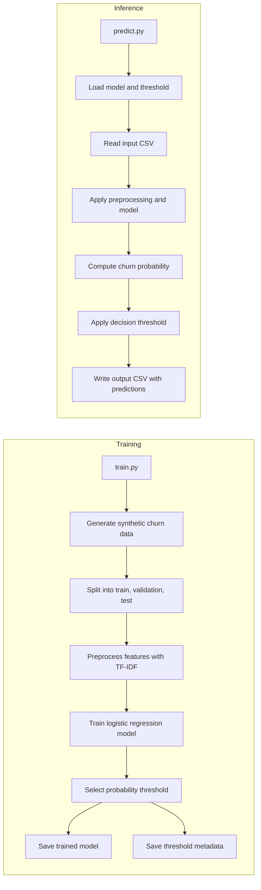

# Customer Churn (Cars)

This project demonstrates a small, end-to-end **customer churn prediction** pipeline for car customers.

It uses:

- Synthetic customer data (no real customer information)
- Text features (`text` column) encoded with **TF-IDF**
- A **Logistic Regression** classifier
- A saved model + decision threshold
- A CLI tool (`predict.py`) that scores new customers from a CSV and writes predictions to a new CSV

---

## Project Structure

```text
Customer Churn (Cars)/
├── data/
│   ├── customers_churn_synthetic.csv     # full synthetic dataset (created by train.py)
│   ├── new_customers.csv                 # example input file for prediction
│   └── new_customers_predictions.csv     # example output file with predictions
├── models/
│   ├── tfidf_logreg_churn.joblib         # trained TF-IDF + LogReg pipeline
│   └── threshold.json                    # chosen decision threshold + metadata
├── predict.py                            # load model + threshold, score new CSV
└── train.py                              # generate data, train, tune, evaluate, save artifacts
```

---

## Pipeline Overview



---

## Requirements

- Python **3.9+**
- Recommended: a virtual environment

Install dependencies:

```bash
pip install numpy pandas scikit-learn joblib
```

(Or put them into a `requirements.txt` and run `pip install -r requirements.txt`.)

---

## 1. Training the Model

From the project root (**Customer Churn (Cars)**):

```bash
python train.py
```

`train.py` will:

1. **Generate synthetic churn data**

   - Saves to: `data/customers_churn_synthetic.csv`
   - Contains columns such as (simplified):
     - `customer_id`
     - `car_model`
     - `contract_type`
     - `tenure_months`
     - `service_calls_last_3m`
     - `satisfaction_score`
     - `monthly_payment`
     - `complaint_level`
     - `text` – free-text description of the customer’s situation
     - `churn` – target (0 = stays, 1 = churns)

2. **Split data** into train / validation / test sets.

3. **Build and train the model**

   - Text column → **TF-IDF** vectorization.
   - Logistic Regression classifier (optionally tuned with a parameter grid).

4. **Pick a decision threshold**

   - Uses validation probabilities to pick a threshold (may be cost-aware, e.g. missing churners is more expensive than false alarms).

5. **Save artifacts** into `models/`:

   - `tfidf_logreg_churn.joblib` – complete scikit-learn pipeline (preprocessing + model).
   - `threshold.json` – contains:
     - `threshold` – chosen probability cutoff
     - other metadata (e.g. feature column names, costs, hyperparameters).

---

## 2. Scoring New Customers

Use `predict.py` to generate churn predictions for any CSV that has the required feature columns.

### Example input

You can create an example file from the synthetic data:

```bash
head -n 50 data/customers_churn_synthetic.csv > data/new_customers.csv
```

### Running predictions

```bash
python predict.py   --input data/new_customers.csv   --output data/new_customers_predictions.csv
```

What `predict.py` does:

1. Loads `models/tfidf_logreg_churn.joblib` and `models/threshold.json`.
2. Reads the input CSV (`--input`).
3. Applies the **same preprocessing** as during training (TF-IDF + any additional features).
4. Computes:
   - `churn_proba` – probability of churn (0–1).
   - `churn_pred` – final 0/1 prediction using the stored threshold.
5. Writes a new file to `--output` (e.g. `data/new_customers_predictions.csv`) containing all original columns plus `churn_proba` and `churn_pred`.

---

## 3. Adapting This Template

Ways you can extend this project:

- Change the synthetic data generator to match your own business logic.
- Replace the synthetic CSV with a **real dataset** that has a `text` column and similar features.
- Adjust the **costs** and thresholding logic in `train.py` to match your cost of false positives vs false negatives.
- Swap Logistic Regression for other models (RandomForest, Gradient Boosting, etc.) while keeping the same pipeline interface.

---

Happy experimenting with churn prediction 🚗📉
