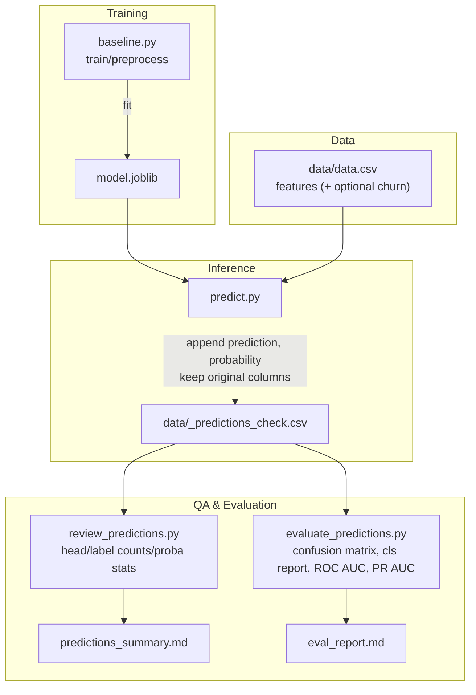

# Customer Churn – Car Models (ML)

A tiny, reproducible machine-learning project that:
- trains a baseline churn model from synthetic customer data,
- saves the model,
- runs batch predictions,
- and (optionally) evaluates predictions if the dataset includes a ground-truth label.

---

## Why this exists (purpose)

- **Practice end-to-end ML** on a compact, friendly dataset.
- Show **clean separation** of training, inference, and evaluation.
- Produce **auditable outputs** (CSV + Markdown summaries) you can read in any editor.

---

## Project layout (what’s here)

```
.
├── data/
│   ├── data.csv                  # input data (features + optional churn label)
│   └── _predictions_check.csv    # predictions with original columns (created by predict.py)
├── baseline.py                   # trains a simple model → model.joblib
├── model.joblib                  # saved model
├── predict.py                    # batch inference
├── review_predictions.py         # quick sanity checks on predictions
├── evaluate_predictions.py       # metrics (needs ground-truth column)
├── predictions_summary.md        # QA summary from review script
├── eval_report.md                # metrics report from evaluate script
├── requirements.txt
└── README.md
```

---

## Quick start (how to run)

```bash
# 0) Create & activate a virtual environment (Python 3.9–3.11 recommended)
python3 -m venv .venv
source .venv/bin/activate            # Windows: .venv\Scripts\activate

# 1) Install dependencies
pip install -r requirements.txt

# 2) Train → writes model.joblib
python3 baseline.py

# 3) Predict → keeps original columns and adds: prediction, probability
python3 predict.py \
  --file ./data/data.csv \
  --model ./model.joblib \
  --out ./data/_predictions_check.csv

# 4) Review predictions → small Markdown summary
python3 review_predictions.py \
  --file ./data/_predictions_check.csv \
  --out predictions_summary.md

# 5) (Optional) Evaluate if you have a ground-truth column (default: churn)
python3 evaluate_predictions.py \
  --file ./data/_predictions_check.csv \
  --label-col prediction \
  --proba-col probability \
  --target churn \
  --out eval_report.md
```

> If your label column isn’t named `churn`, change `--target` to match your data.  
> Want a custom decision threshold? Add `--threshold 0.55` to `predict.py`.

---

## How to read the outputs

**`data/_predictions_check.csv`**
- Contains the original input columns plus:
  - `prediction` → 1 = predicted churn, 0 = predicted stay.
  - `probability` → model’s confidence for churn (0–1).  
- Sort by highest `probability` to see likely churners first.

**`predictions_summary.md`** *(from `review_predictions.py`)*
- Shows:
  - a quick `head` of the predictions,
  - **label counts** (how many 1s/0s were predicted at the current threshold),
  - **probability stats** (min/mean/max, quartiles).

**`eval_report.md`** *(from `evaluate_predictions.py`, if ground truth is present)*
- Includes **confusion matrix**, **precision/recall/F1**, and **ROC/PR AUC**.
- Reading tips:
  - **Precision**: Of those predicted as churn, how many actually churned?
  - **Recall**: Of all true churners, how many did we catch?
  - **ROC AUC**: Overall ranking quality (higher is better).
  - **PR AUC**: Positive-class quality when churn is rare.

---

## Visual overview



---

## Notes
- Set a **random seed** in training if you want fully reproducible splits.
- If you’ll join predictions back later, add a stable `row_id` to your data first.
- You can swap the model in `baseline.py` (e.g., Random Forest) without changing the rest.
- 
