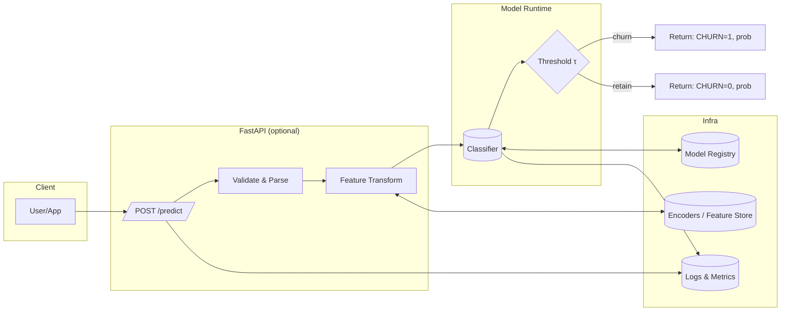
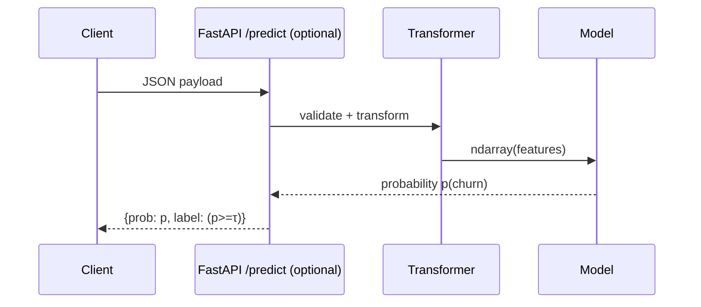
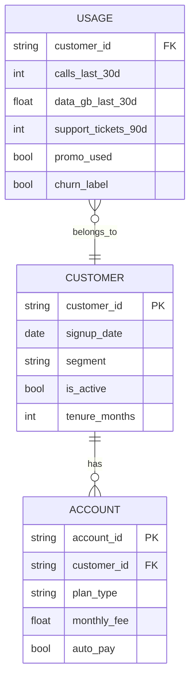
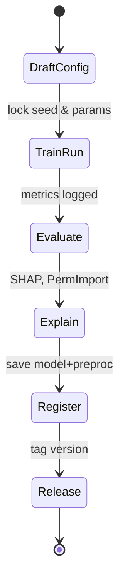
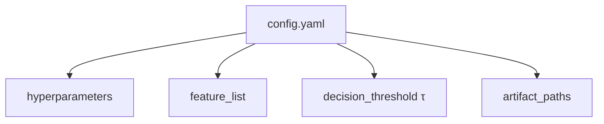
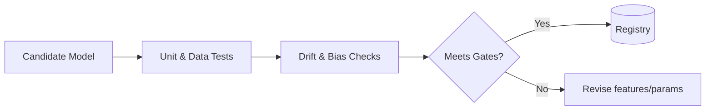
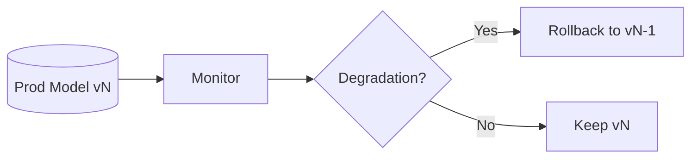

# Customer Churn Prediction

A compact, **diagram‑first** project for training and serving a churn classifier.  
This README is ready to paste into your repository and renders diagrams on GitHub (Mermaid).

> **Tech highlights:** Python, scikit‑learn / XGBoost or LightGBM, SHAP, permutation importance, reproducible runs.

---

## Quick Start

> Requires Python 3.9+

```bash
# 1) (optional) create & activate a venv
python -m venv .venv && source .venv/bin/activate  # Windows: .venv\\Scripts\\activate

# 2) install common deps
pip install -U pandas numpy scikit-learn xgboost lightgbm shap matplotlib joblib

# 3) run a baseline
python baseline.py --data data.csv

# 4) train a model
python train.py --data data.csv --model-out models/model.pkl --encoders-out models/encoders.pkl --run-dir runs/exp_001

# 5) explainability (SHAP + permutation importance)
python shap_explain.py --model models/model.pkl --encoders models/encoders.pkl --data data.csv --out runs/exp_001/shap/
python perm_importance.py --model models/model.pkl --encoders models/encoders.pkl --data data.csv --out runs/exp_001/perm/

# 6) predict
python predict.py --model models/model.pkl --encoders models/encoders.pkl --json '{"tenure_months": 12, "monthly_fee": 69.0, "auto_pay": true, "support_tickets_90d": 2, "segment":"consumer"}'
```

> Tip: Replace `xgboost` with `lightgbm` if preferred; scripts are agnostic as long as the estimator implements `.fit` and `.predict_proba`.

---

## Repository Layout

```
.
├── data.csv
├── baseline.py
├── train.py
├── predict.py
├── shap_explain.py
├── perm_importance.py
├── models/
└── runs/
```

---

## System Overview



---

## Data Lineage & Training Pipeline

```mermaid
flowchart TB
  SRC[Raw CSV/Parquet] --> CLN[Clean & Impute]
  CLN --> FE[Feature Engineering<br/> (encoders, bins, ratios)]
  FE --> SPLIT{Train/Valid/Test}
  SPLIT --> TRN[Train Model<br/>(XGB/LGBM/SKLearn)]
  TRN --> EVAL[Evaluate<br/>(AUC/PR, F1, Recall@K)]
  TRN --> EXPL[Explainability<br/>(SHAP, PermImport)]
  EVAL --> ART[Persist Artifacts]
  EXPL --> ART
  ART --> REG[(Register Model + Encoders)]
```

---

## Serving Flow (Request → Decision)



---

## Data Model (Simplified)



---

## Experiment Lifecycle



---

## Config at a Glance (Optional)



---

## Quality Gates



---

## Rollback Strategy



---

## CLI (Arguments Summary)

- `baseline.py` — quick sanity model & metrics on `data.csv`
- `train.py` — trains, evaluates, saves `models/model.pkl` and `models/encoders.pkl`
- `predict.py` — loads artifacts and scores single JSON or a CSV
- `shap_explain.py` — SHAP global & local plots
- `perm_importance.py` — permutation feature importance

> All scripts accept `--help` for exact flags.

---

## Rendering Mermaid Locally

GitHub renders Mermaid diagrams automatically.  
For local preview, use VS Code with **Markdown Preview Mermaid Support** extension.

---

## License

MIT (or your preferred license)
