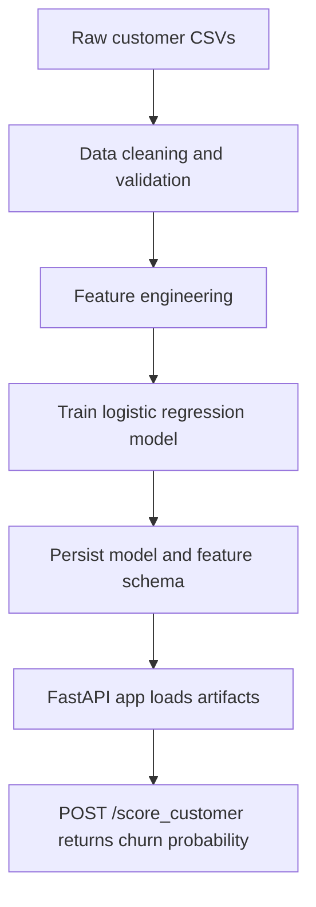

# Customer Metrics Pipeline & API

End-to-end example of a small **customer churn metrics pipeline** with a **production-style FastAPI scoring service**.

- **Data science side**: generate / load customer features, train a simple classifier, and persist the model + feature metadata.
- **Engineering side**: expose a **`/score_customer`** endpoint that validates input with Pydantic, loads the trained model, and returns a JSON score.

This project is designed to be understandable in under an hour but still reflect patterns you would see in a production codebase.

---

## High-Level Architecture



## Features

- **Training pipeline**
  - Reads customer-level data into pandas.
  - Performs basic feature engineering & cleaning.
  - Trains a **Logistic Regression** churn model using scikit-learn.
  - Saves:
    - `models/customer_churn_model.joblib` (or similar)  
    - `models/feature_columns.json` (list of feature names and ordering).

- **FastAPI scoring service**
  - Starts a FastAPI app with a `/health` and `/score_customer` endpoint.
  - On startup, loads the model + feature metadata.
  - Validates input using a Pydantic `CustomerFeatures` schema.
  - Builds a **single-row DataFrame in exactly the same column order** as used in training.
  - Returns JSON with:
    - `churn_probability` (0–1)
    - `churn_label` (0 or 1, based on threshold 0.5)
    - `feature_order` (for debugging / transparency).

---

## Project Structure

A typical layout (exact names may vary slightly depending on how you set it up):

```text
customer_metrics/
├── customer_metrics/
│   ├── __init__.py
│   ├── config.py             # Paths (MODEL_PATH, FEATURE_COLUMNS_JSON, etc.)
│   ├── data_pipeline.py      # (Optional) ETL / feature engineering helpers
│   └── ...
├── models/
│   ├── customer_churn_model.joblib
│   └── feature_columns.json
├── data/
│   └── customers_churn_synthetic.csv
├── main.py                   # FastAPI app (this is where /score_customer lives)
├── run_pipeline.py           # Script to train and persist model + metadata
├── requirements.txt
└── README.md
```

---

## Installation

1. **Clone the repository**

```bash
git clone https://github.com/your-username/customer-metrics-pipeline-api.git
cd customer-metrics-pipeline-api
```

2. **Create and activate a virtual environment (recommended)**

```bash
python -m venv .venv
source .venv/bin/activate   # On Windows: .venv\Scripts\activate
```

3. **Install dependencies**

```bash
pip install -r requirements.txt
```

The main libraries used are:

- `fastapi`
- `uvicorn`
- `pydantic`
- `pandas`
- `numpy`
- `scikit-learn`
- `joblib`

---

## 1. Train the Model (Offline Pipeline)

Before starting the API, run the training pipeline so that the model and feature metadata exist on disk.

```bash
python run_pipeline.py
```

What `run_pipeline.py` typically does:

1. Loads raw / synthetic customer data from `data/customers_churn_synthetic.csv`.
2. Selects and cleans the **feature columns** such as:
   - `age`
   - `tenure_months`
   - `avg_monthly_spend`
   - `num_support_tickets`
   - `is_premium`
3. Trains a **Logistic Regression** model to predict churn.
4. Writes:
   - `MODEL_PATH` – e.g. `models/customer_churn_model.joblib`
   - `FEATURE_COLUMNS_JSON` – e.g. `models/feature_columns.json` with:

      ```json
      {
          "feature_columns": [
              "age",
              "tenure_months",
              "avg_monthly_spend",
              "num_support_tickets",
              "is_premium"
          ]
      }
      ```

If these files are missing, the API will refuse to start and will tell you to run the pipeline first.

---

## 2. FastAPI Service (Online Scoring)

### `main.py` (core idea)

`main.py` exposes two endpoints using FastAPI:

- `GET /health`
- `POST /score_customer`

The key pieces:

```python
# main.py (excerpt)
import json
from typing import List

import joblib
import pandas as pd
from fastapi import FastAPI, HTTPException
from pydantic import BaseModel, Field

from customer_metrics.config import MODEL_PATH, FEATURE_COLUMNS_JSON


class CustomerFeatures(BaseModel):
    age: int = Field(..., ge=0, le=120)
    tenure_months: int = Field(..., ge=0)
    avg_monthly_spend: float = Field(..., ge=0)
    num_support_tickets: int = Field(..., ge=0)
    is_premium: int = Field(..., ge=0, le=1)


class ScoreResponse(BaseModel):
    churn_probability: float
    churn_label: int
    feature_order: List[str]


app = FastAPI(title="Customer Metrics Pipeline & API")

_model = None
_feature_columns: List[str] = []


def load_artifacts() -> None:
    global _model, _feature_columns

    if not MODEL_PATH.exists():
        raise RuntimeError(
            f"Model file not found at {MODEL_PATH}. "
            "Run the training pipeline first (python run_pipeline.py)."
        )

    _model = joblib.load(MODEL_PATH)

    try:
        with FEATURE_COLUMNS_JSON.open() as f:
            meta = json.load(f)
        _feature_columns = meta["feature_columns"]
    except Exception as exc:
        raise RuntimeError(f"Error loading feature metadata: {exc}") from exc


@app.on_event("startup")
def startup_event():
    load_artifacts()


@app.get("/health")
def health():
    return {"status": "ok", "model_loaded": _model is not None}


@app.post("/score_customer", response_model=ScoreResponse)
def score_customer(customer: CustomerFeatures):
    if _model is None:
        raise HTTPException(status_code=500, detail="Model not loaded")

    # Build a single-row DataFrame with the expected column order
    data = {col: getattr(customer, col) for col in _feature_columns}
    X = pd.DataFrame([data])

    proba = float(_model.predict_proba(X)[0, 1])
    label = int(proba >= 0.5)

    return ScoreResponse(
        churn_probability=round(proba, 4),
        churn_label=label,
        feature_order=_feature_columns,
    )
```

### Start the API Server

From the project root:

```bash
uvicorn main:app --reload
```

- The API will start on `http://127.0.0.1:8000` (by default).
- On startup it will call `load_artifacts()`, loading the model and feature metadata.

---

## 3. Using the API

### Health Check

```bash
curl http://127.0.0.1:8000/health
```

Example response:

```json
{
  "status": "ok",
  "model_loaded": true
}
```

### Score a Single Customer

```bash
curl -X POST "http://127.0.0.1:8000/score_customer"      -H "Content-Type: application/json"      -d '{
           "age": 42,
           "tenure_months": 18,
           "avg_monthly_spend": 120.50,
           "num_support_tickets": 3,
           "is_premium": 1
         }'
```

Example response:

```json
{
  "churn_probability": 0.2371,
  "churn_label": 0,
  "feature_order": [
    "age",
    "tenure_months",
    "avg_monthly_spend",
    "num_support_tickets",
    "is_premium"
  ]
}
```

- `churn_label` is 1 if `churn_probability >= 0.5`, otherwise 0.
- `feature_order` is helpful for debugging and confirming that your training and serving pipelines are aligned.

---

## Design Notes

- **Strict schema validation**  
  `CustomerFeatures` uses Pydantic with basic constraints (`ge`, `le`) so invalid requests are rejected early with clear error messages.

- **Artifact-driven design**  
  The API is intentionally *dumb* about feature engineering: it trusts whatever feature names and order are defined in `feature_columns.json`. This mirrors production patterns where models and metadata are owned by the ML pipeline.

- **Single responsibility**  
  The model training logic lives in the offline pipeline (`run_pipeline.py` and related modules). The FastAPI app is focused only on:
  1. Validating input
  2. Loading artifacts
  3. Calling `predict_proba`
  4. Formatting a response

---

## Extending the Project

Here are some natural next steps:

- **Batch scoring**: Add an endpoint to score a list of customers at once (e.g., `POST /score_customers` with an array of JSON objects).
- **Custom thresholds**: Allow clients to send a custom decision threshold (e.g., `0.3` for more aggressive retention).
- **Model versioning**: Store separate folders like `models/v1/`, `models/v2/` and add a query parameter or header for selecting the version.
- **Authentication**: Wrap the scoring endpoint with an API key or OAuth2 for real-world deployment.

---

## License

Add your preferred license here (for example, MIT):

```text
MIT License
Copyright (c) 2025 John Doan
```

