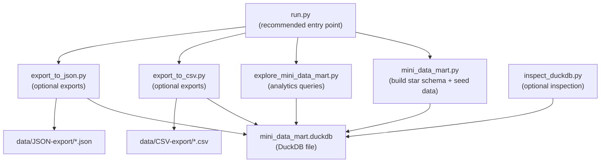
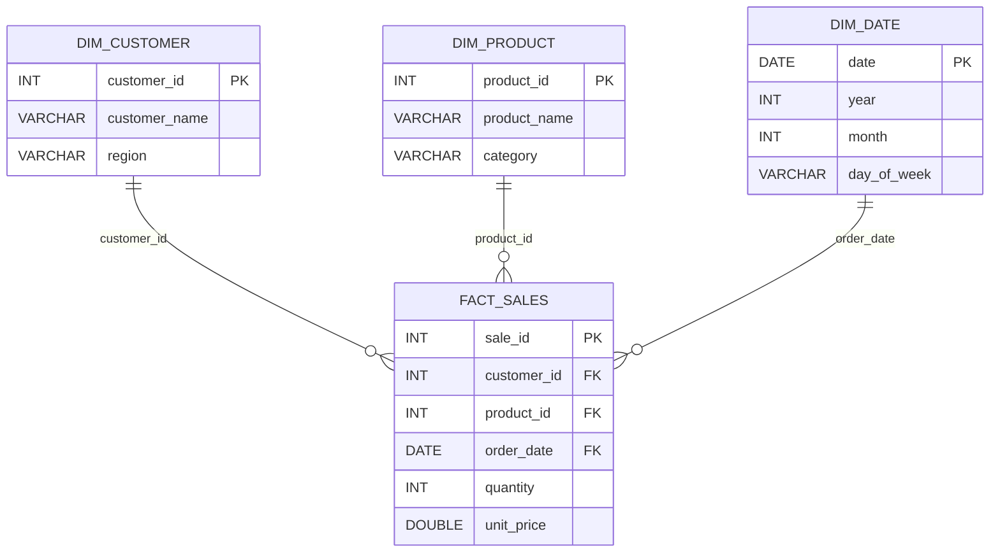

# Mini Data Mart with DuckDB — Stage 1 (Hardcoded Seed Data)

This project demonstrates a small **star-schema mini data mart** built with **DuckDB** and **Python**.  
Stage 1 focuses on the **schema + ETL build script** and a simple **exploration + export** workflow.

## Data note (important)
All data in Stage 1 is **synthetic / manually seeded for learning purposes** (hardcoded inserts in `mini_data_mart.py`).  
It does **not** contain real customer data or production data. fileciteturn60file6L5-L8

---

## What Stage 1 builds

- DuckDB database file: `mini_data_mart.duckdb`
- Dimension tables: `dim_customer`, `dim_product`, `dim_date`
- Fact table: `fact_sales`
- Example analytics queries (revenue by customer and category)
- Optional exports:
  - `data/CSV-export/` (CSV)
  - `data/JSON-export/` (JSON) fileciteturn60file6L11-L22

---

## Project structure (Stage 1)

```text
Mini Data Mart with DuckDB (Stage 1)/
├─ data/
│  ├─ CSV-export/              # generated outputs (safe to delete)
│  └─ JSON-export/             # generated outputs (safe to delete)
├─ mini_data_mart.py           # builds DB + schema + inserts synthetic seed data
├─ explore_mini_data_mart.py   # runs example analytics queries
├─ export_to_csv.py            # optional export to data/CSV-export/
├─ export_to_json.py           # optional export to data/JSON-export/
├─ inspect_duckdb.py           # optional helper (tables, row counts, quick checks)
├─ run.py                      # recommended entry point (build + explore)
├─ requirements.txt
└─ README.md
```

---

## Architecture diagrams (Mermaid)

### 1) Script workflow



### 2) Star schema (logical ER)



---

## Quick start (terminal)

From the project folder:

### 1) Create and activate a virtual environment
```bash
python3 -m venv .venv
source .venv/bin/activate
```

### 2) Install dependencies
```bash
pip install -r requirements.txt
```

### 3) Run (recommended)
```bash
python run.py
```

Or run the steps explicitly:
```bash
python mini_data_mart.py
python explore_mini_data_mart.py
```
fileciteturn60file15L5-L30

---

## Where outputs go

- DuckDB database file:
  - `mini_data_mart.duckdb`
- CSV exports:
  - `data/CSV-export/*.csv`
- JSON exports:
  - `data/JSON-export/*.json` fileciteturn60file15L44-L52

---

## Reset / rebuild from scratch (safe cleanup)

### Safe to delete (generated outputs)
You can delete these at any time; they are recreated by the scripts:

- `mini_data_mart.duckdb`
- `data/CSV-export/`
- `data/JSON-export/` fileciteturn60file15L55-L63

### One-command reset (macOS/Linux)
```bash
rm -f mini_data_mart.duckdb
rm -rf data/CSV-export data/JSON-export
python run.py
```

---

## Troubleshooting

### “ModuleNotFoundError: duckdb”
Your venv may not be active, or dependencies aren’t installed:
```bash
source .venv/bin/activate
pip install -r requirements.txt
```

### “Table ... does not exist” in explore/export scripts
That usually means the DB was deleted but not rebuilt yet:
```bash
python mini_data_mart.py
python explore_mini_data_mart.py
```
fileciteturn60file11L55-L71

---

## Stage 2 idea (next)
Stage 2 can switch from **hardcoded seed inserts** to loading the fact table (and/or dims) from **CSV inputs**, so updating input files automatically changes what gets loaded into DuckDB.
