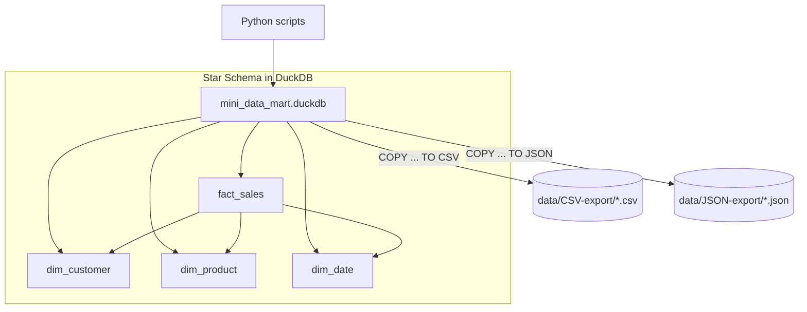

# Mini Data Mart with DuckDB (Python)

This project demonstrates how to build a small **star-schema mini data mart** using **DuckDB** and **Python** (works well in PyCharm or from the terminal).

## Data note (important)
All data used in this project is **synthetic / generated for learning purposes**.  
It does **not** contain real customer data or production data.

---

## What this project builds

It creates:

- A DuckDB database file: `mini_data_mart.duckdb`
- Dimension tables: `dim_customer`, `dim_product`, `dim_date`
- A fact table: `fact_sales`
- Example analytics queries (e.g., revenue by customer and category)
- Optional exports to:
  - `data/CSV-export/` (CSV)
  - `data/JSON-export/` (JSON)

---

## Star schema overview

- **Dimensions**
  - `dim_customer` — who bought (customer name, region)
  - `dim_product` — what was bought (product name, category)
  - `dim_date` — when it was bought (date, year, month, day_of_week)
- **Fact**
  - `fact_sales` — measurable events (quantity, unit_price, sale_id)

---

## Project files (what to run)

Common scripts in this project:

- `run.py`
  - Recommended entry point (build + basic exploration).
- `mini_data_mart.py`
  - Builds the DuckDB file and creates/populates all tables (star schema).
- `explore_mini_data_mart.py`
  - Connects to the DuckDB file, shows sample rows, and runs analytics queries.
- `export_to_csv.py` (optional)
  - Exports tables to `data/CSV-export/`.
- `export_to_json.py` (optional)
  - Exports tables to `data/JSON-export/`.
- `inspect_duckdb.py` (optional)
  - Quick inspection helper (list tables, preview row counts, etc.).

> Note: If you try to run `build_mini_data_mart.py` and it says “No such file”, that means your project uses the newer name: **`mini_data_mart.py`**.

---

## Quick start (terminal)

From the project folder:

### 1) Create and activate a virtual environment
```bash
python3 -m venv .venv
source .venv/bin/activate
```

### 2) Install dependencies
```bash
pip install -r requirements.txt
```

### 3) Build + run (recommended)
```bash
python run.py
```

Or run the steps explicitly:
```bash
python mini_data_mart.py
python explore_mini_data_mart.py
```

### 4) Export outputs (optional)
CSV:
```bash
python export_to_csv.py
```

JSON:
```bash
python export_to_json.py
```

---

## Where outputs go

- DuckDB database file:
  - `mini_data_mart.duckdb`
- CSV exports:
  - `data/CSV-export/*.csv`
- JSON exports:
  - `data/JSON-export/*.json`

---

## Reset / rebuild from scratch (recommended for a clean rerun)

### Safe to delete (generated outputs)
You can delete these at any time; they are recreated by the scripts:

- `mini_data_mart.duckdb`  *(the DuckDB database file)*
- `data/CSV-export/`       *(generated CSV exports)*
- `data/JSON-export/`      *(generated JSON exports)*

### Keep (source inputs + code)
Do **not** delete these if you want to rebuild successfully:

- `fact_sales.csv` *(the input fact data used to populate the mart)*
- Python scripts: `mini_data_mart.py`, `run.py`, `explore_mini_data_mart.py`, etc.
- `requirements.txt` (and `README.md`)

### One-command reset (macOS/Linux)
Run this from the project root:
```bash
rm -f mini_data_mart.duckdb
rm -rf data/CSV-export data/JSON-export
```

Then rebuild:
```bash
python mini_data_mart.py
python explore_mini_data_mart.py
```

Or just:
```bash
python run.py
```

> Common gotcha: If you paste lines that start with `#` into the terminal, `zsh` may treat them as commands (depending on how you pasted). When copying commands, paste only the command lines (no `# optional:` comments).

### Full reset (optional)
If you want a completely fresh environment too:
```bash
rm -rf .venv
python3 -m venv .venv
source .venv/bin/activate
pip install -r requirements.txt
```

---

## Architecture diagram (Mermaid)



---

## Troubleshooting

### “ModuleNotFoundError: duckdb”
Your venv may not be active, or dependencies aren’t installed.
```bash
source .venv/bin/activate
pip install -r requirements.txt
```

### “Table ... does not exist” in explore/export scripts
That usually means the DB was deleted but not rebuilt yet.

Fix:
```bash
python mini_data_mart.py
python explore_mini_data_mart.py
```

### Database not updating
Delete the DB file and rebuild:
```bash
rm -f mini_data_mart.duckdb
python mini_data_mart.py
```

---

## Next enhancements
- Add a synthetic-data generator script (to make the dataset reproducible)
- Add basic tests (pytest) for build + export steps
- Add a `requirements.txt` / `pyproject.toml` for reproducible installs
