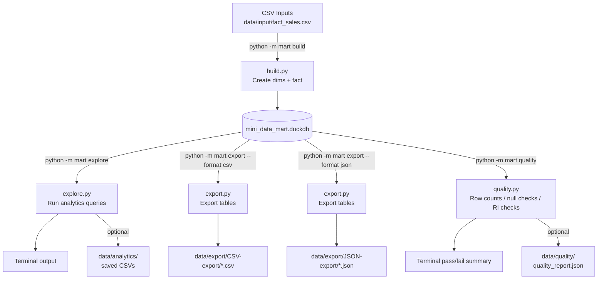

# Mini Data Mart with DuckDB — Stage 3 (CLI + Quality Checks)

Stage 3 upgrades the mini data mart into a small **Python package** with a **CLI**:

- **CSV-driven inputs** (continues Stage 2)
- **Repeatable build** into a local DuckDB file
- **Explore** analytics queries (terminal output; optional saved artifacts)
- **Export** tables to CSV/JSON outputs
- **Quality checks** (row counts, null checks, referential integrity)

> **Data source:** synthetic / generated data for learning and demonstration purposes.

---

## What’s New in Stage 3

### Key improvements
- Package layout: `mart/` contains reusable modules (`config`, `build`, `explore`, `export`, `quality`).
- CLI entry point: `python -m mart <command>`
- Config-driven paths (single place to change DB + input/output locations).
- CSV schema flexibility: `build.py` can load **ID-based** or **name-based** CSVs (depending on columns present).

---

## Project Structure

Typical structure (Stage 3):

```
Mini Data Mart with DuckDB (Stage 3)/
├─ mart/
│  ├─ __init__.py
│  ├─ __main__.py        # CLI entry point
│  ├─ config.py          # paths + config + connect()
│  ├─ build.py           # build/rebuild mart (DuckDB tables)
│  ├─ explore.py         # example analytics queries
│  ├─ export.py          # export tables to CSV/JSON
│  └─ quality.py         # data quality checks
├─ data/
│  ├─ input/
│  │  └─ fact_sales.csv
│  ├─ export/
│  │  ├─ CSV-export/
│  │  └─ JSON-export/
│  ├─ analytics/         # optional (saved query outputs)
│  └─ quality/           # optional (quality reports)
├─ mini_data_mart.duckdb # generated
├─ requirements.txt
└─ README.md
```

---

## Mermaid Flowchart (Stage 3)



---

## Requirements

- Python **3.11+** recommended (3.12 also fine).  
  (If you use Python 3.13, ensure wheels exist for `duckdb`, `numpy`, and `pandas` on your platform.)
- `duckdb`
- `pandas` (optional depending on your `explore.py` / exports)
- `numpy` (often required by pandas)

---

## Setup (Recommended)

### 1) Create a virtual environment
From the Stage 3 project folder:

```bash
python3 -m venv .venv
source .venv/bin/activate
```

### 2) Ensure pip exists in the venv
If you ever see `No module named pip`:

```bash
python3 -m ensurepip --upgrade
python3 -m pip install --upgrade pip
```

### 3) Install dependencies
```bash
python3 -m pip install -r requirements.txt
# or:
python3 -m pip install duckdb pandas numpy
```

---

## Run the CLI (Stage 3)

Always prefer `python3 -m ...` style commands:

### Build (creates/rebuilds DuckDB tables)
```bash
python3 -m mart build
```

### Explore (runs example analytics queries)
```bash
python3 -m mart explore
```

### Export (writes output tables)
```bash
python3 -m mart export
python3 -m mart export --format csv
python3 -m mart export --format json
```

### Quality checks
```bash
python3 -m mart quality
```

---

## “Run Everything” (Typical Workflow)

```bash
# 1) Build tables from CSV inputs
python3 -m mart build

# 2) (Optional) quality checks
python3 -m mart quality

# 3) Explore analytics queries
python3 -m mart explore

# 4) Export tables
python3 -m mart export --format all
```

---

## Reset / Rebuild From Scratch

To fully reset your environment (DB + outputs):

```bash
rm -f mini_data_mart.duckdb
rm -rf data/export/CSV-export data/export/JSON-export
rm -rf data/analytics data/quality
```

Then rebuild:

```bash
python3 -m mart build
```

---

## Inputs: `fact_sales.csv`

Stage 3 supports different CSV shapes.

### Option 1: ID-based CSV (preferred for stable keys)
Columns may include:
- `sale_id` (optional)
- `customer_id` OR `customer_name` (+ optional `region`)
- `product_id` OR `product_name` (+ optional `category`)
- `order_date` (required, `YYYY-MM-DD`)
- `quantity` (required)
- `unit_price` (required)

### Option 2: Name-based CSV (convenient for editing)
If you don’t provide IDs, `build.py` will generate IDs using stable ordering.

**Note:** IDs are generated based on distinct `(customer_name, region)` and `(product_name, category)`.  
If you change names/regions/categories, IDs can shift (expected behavior).

---

## About `data/analytics/` and `data/quality/`

- `data/analytics/` is **optional** and may stay empty if `explore.py` prints results only.
- `data/quality/` is **optional** and may stay empty if `quality.py` prints pass/fail only.
- If you want portfolio artifacts, you can add optional report writing:
  - `data/analytics/*.csv`
  - `data/quality/quality_report.json`

**Tip:** keep empty folders tracked with `.gitkeep` files if desired.

---

## Troubleshooting

### “It runs in my IDE but fails in terminal”
Your IDE may be using a **different interpreter** than your shell.

Verify:

```bash
which python3
python3 -c "import sys; print(sys.executable)"
python3 -m pip -V
```

Make sure those point to your project’s `.venv`.

### “ModuleNotFoundError: duckdb”
Install into the active venv:

```bash
python3 -m pip install duckdb
python3 -c "import duckdb; print(duckdb.__version__)"
```

---

## Next Stage Ideas (Stage 4+)

- Multiple input CSVs: separate `dim_customer.csv`, `dim_product.csv`, `dim_date.csv`, plus fact
- Stronger quality rules: uniqueness, ranges, referential integrity enforcement, fail-fast mode
- Parameterized analytics (date ranges, filters) and saved outputs
- Streamlit / Dash dashboard for BI-style exploration
