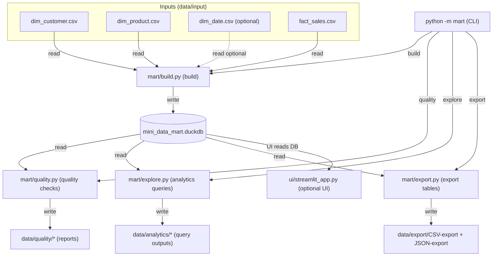

# Mini Data Mart with DuckDB — Stage 4 (Multi-CSV + Optional UI)

Stage 4 extends Stage 3 by allowing **multiple input CSVs** (separate dimension CSVs + fact CSV), adding **stronger key-resolution rules**, and supporting an optional **UI layer** (Streamlit and/or a Tkinter desktop app).

> **Data source:** Synthetic / generated data for learning and demonstration only (no real customer or production data).

---

## What’s new in Stage 4 (vs Stage 3 / Stage 2 / Stage 1)

- **Stage 1:** Hardcoded seed data inserted into DuckDB tables (dims + fact).
- **Stage 2:** CSV-driven load (typically the fact table) so changing the CSV changes what gets loaded.
- **Stage 3:** A simple **CLI** (`python -m mart ...`), plus **exports**, **analytics outputs**, and **quality checks**.
- **Stage 4:** Multiple CSV inputs:
  - `dim_customer.csv`, `dim_product.csv`, optional `dim_date.csv`, plus `fact_sales.csv`
  - Build fails fast when keys cannot be resolved (unless you run in non-strict mode, if implemented)

---

## Folder layout (Stage 4)

```
<stage-4-root>/
  mart/
    __main__.py
    build.py
    explore.py
    export.py
    quality.py
    config.py
  ui/
    streamlit_app.py
  ui_desktop/
    app_tk.py
  data/
    input/
      dim_customer.csv
      dim_product.csv
      dim_date.csv        # optional (can be computed from fact)
      fact_sales.csv
    export/
      CSV-export/
      JSON-export/
    analytics/
    quality/
  mini_data_mart.duckdb
```

**Expected outputs**
- `data/export/*` → written by `python -m mart export`
- `data/analytics/*` → written by `python -m mart explore` (saved query outputs)
- `data/quality/*` → optional logs/summaries written by `python -m mart quality`
- `mini_data_mart.duckdb` → created by `python -m mart build`

---

## CSV schemas (choose ONE approach and stay consistent)

Your build step typically supports **ID-based** or **name-based** key resolution. Pick one pattern and use it consistently across dims + fact.

### Option A: ID-based (recommended for “real” warehouse-style modeling)

**dim_customer.csv**
```csv
customer_id,customer_name,region
1,Alice Regan,North
2,Bobby Jamie,South
```

**dim_product.csv**
```csv
product_id,product_name,category
10,Laptop,Electronics
12,Desk Chair,Furniture
```

**fact_sales.csv**
```csv
sale_id,customer_id,product_id,order_date,quantity,unit_price
1001,1,10,2025-01-01,1,1200.00
1002,2,12,2025-01-02,2,300.00
```

### Option B: Name-based (easy for learning; dims can be derived)

If you prefer writing facts with business-friendly fields:

**dim_customer.csv**
```csv
customer_name,region
Alice Regan,North
Bobby Jamie,South
```

**dim_product.csv**
```csv
product_name,category
Laptop,Electronics
Desk Chair,Furniture
```

**fact_sales.csv**
```csv
sale_id,customer_name,region,product_name,category,order_date,quantity,unit_price
1,Alice Regan,North,Laptop,Electronics,2025-01-01,1,1200.00
2,Bobby Jamie,South,Desk Chair,Furniture,2025-01-02,2,300.00
```

### Notes that prevent common build failures

- **All CSVs must have a header row.**  
  If you see: `Found: ['column0']` it usually means the file is missing headers (or was saved incorrectly).
- Avoid leading/trailing spaces in headers and values (e.g., `" region"` vs `"region"`).
- Dates should be `YYYY-MM-DD`.
- If you remove `dim_date.csv`, the build may compute `dim_date` from the fact’s `order_date` (depending on implementation).

---

## Run from scratch (clean rebuild)

Run these commands from the **Stage 4 root folder** (the folder that contains `mart/`).

### 1) Activate venv and install dependencies

```bash
python3 -m venv .venv
source .venv/bin/activate

# If pip is missing:
python -m ensurepip --upgrade

python -m pip install --upgrade pip
python -m pip install duckdb
# Optional:
python -m pip install streamlit
```

### 2) Reset generated outputs (keep your input CSVs)

```bash
rm -f mini_data_mart.duckdb
rm -rf data/export/CSV-export data/export/JSON-export
rm -rf data/analytics data/quality
```

### 3) Build → quality → explore → export

```bash
python -m mart build
python -m mart quality
python -m mart explore
python -m mart export
```

If your build supports a non-strict mode (so unresolved rows are dropped instead of failing), use the flag defined in your Stage 4 CLI/build script.

---

## UI options

### Streamlit (browser UI)

If `streamlit` is not found, install it in your venv:

```bash
python -m pip install streamlit
```

Run Streamlit from the project root:

```bash
python -m streamlit run ui/streamlit_app.py
```

### Tkinter (desktop app)

Tkinter is part of the Python standard library. The most common error is:

`ModuleNotFoundError: No module named 'mart'`

Fix by running from the **project root** and setting `PYTHONPATH`:

```bash
PYTHONPATH=. python ui_desktop/app_tk.py
```

(Alternative: make `ui_desktop/` a package and run `python -m ui_desktop.app_tk`.)

---

## Mermaid flowchart



---

## Troubleshooting

### `python -m mart ui` fails
The Stage 4 CLI subcommands are typically:
- `build`, `quality`, `explore`, `export`

UI is launched separately (Streamlit/Tkinter), not via the CLI unless you explicitly add a `ui` subcommand.

### `zsh: command not found: #`
This happens when you paste lines starting with `#` into the terminal. Paste only the commands, or put them into a `.sh` script.

### Build errors: “unresolved dimension keys”
This means **fact rows cannot be matched to dimensions**. Fix by:
- Making sure `dim_customer.csv` and `dim_product.csv` contain the keys/names referenced by `fact_sales.csv`
- Using one consistent approach (ID-based or name-based)
- Removing `dim_date.csv` if your build can compute dates from the fact file
