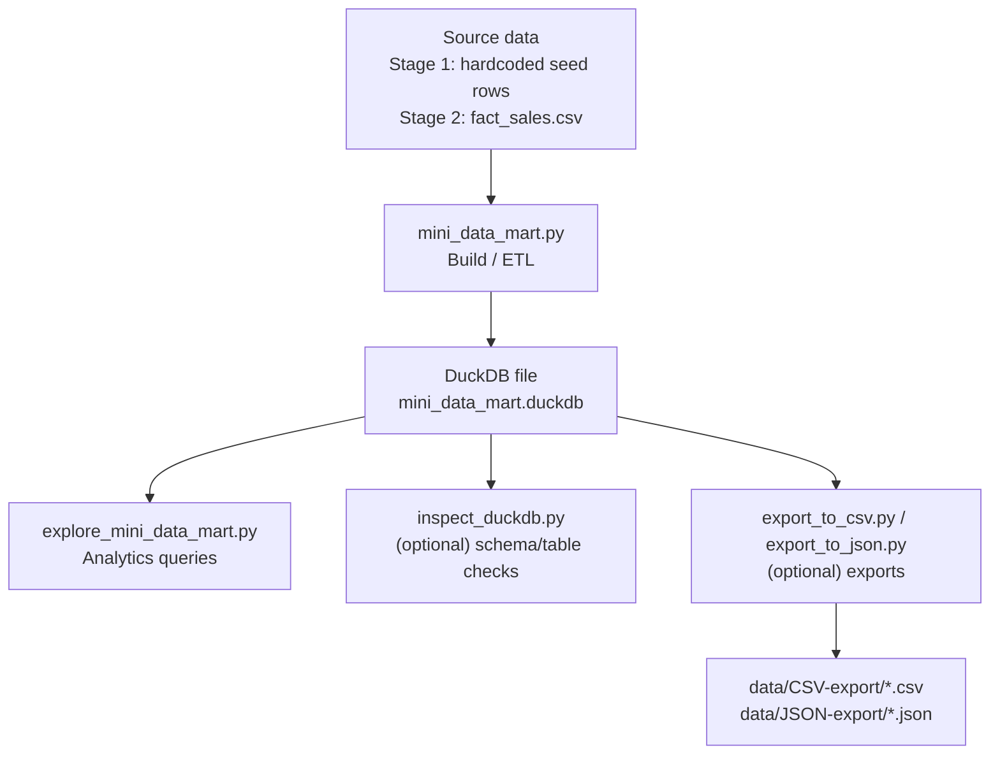
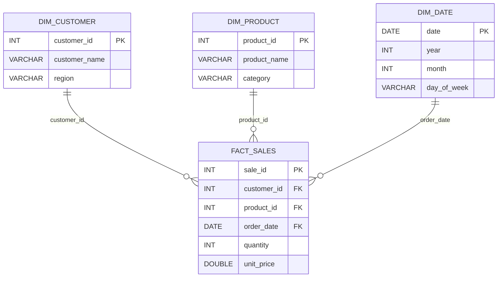

# Mini Data Mart with DuckDB (Python)

A small **star-schema “mini data mart”** built with **DuckDB** + **Python**.  
It’s designed as a portfolio-friendly analytics project: repeatable build scripts, clean dimensional modeling, and example queries.

> **Data note:** All data is **synthetic / generated** for learning and demo purposes (no real customer or production data).

---

## Instructions to run the project

- Build a **DuckDB database file** (`mini_data_mart.duckdb`)
- Load a **star schema**:
  - `dim_customer`, `dim_product`, `dim_date`
  - `fact_sales`
- Run **analytics queries** (examples provided)
- (Optional) Export results to **CSV / JSON**
- In Stage 2: edit a CSV file and **rebuild** the warehouse to instantly reflect new data

---

## Architecture overview



---

## Star schema (logical model)



---

## Stages 

### Stage 1 — Hardcoded seed data

- `mini_data_mart.py` creates the schema and inserts a small synthetic dataset directly in code.
- Great for: proving the schema + queries work end-to-end.

### Stage 2 — CSV-driven build (repeatable pipeline)

- `fact_sales.csv` becomes the **source-of-truth** for the fact table input.
- The build script loads to a staging table and **auto-builds dimensions** from distinct names/dates.
- Great for: real “data pipeline” workflow (edit input → rebuild DB → rerun analytics).

---

## Project structure (typical)

Stage 1 (example):

```
Mini Data Mart with DuckDB (Stage 1)/
├─ mini_data_mart.py
├─ explore_mini_data_mart.py
├─ inspect_duckdb.py
├─ export_to_csv.py
├─ export_to_json.py
├─ run.py
├─ requirements.txt
└─ README.md
```

Stage 2 (example):

```
Mini Data Mart with DuckDB (Stage 2)/
├─ mini_data_mart.py
├─ explore_mini_data_mart.py
├─ inspect_duckdb.py
├─ export_to_csv.py
├─ export_to_json.py
├─ fact_sales.csv
├─ fact_sales.template.csv
├─ mini_data_mart.duckdb          # generated
└─ data/
   ├─ CSV-export/                 # generated
   └─ JSON-export/                # generated
```

---

## Requirements

- **Python 3.11+** recommended
- Python package:
  - `duckdb`
- Optional (only if your exporter scripts use it):
  - `pandas`

---

## Setup

### 1) Create and activate a virtual environment

```bash
python3 -m venv .venv
source .venv/bin/activate
```

### 2) Install dependencies

If you have `requirements.txt`:

```bash
pip install -r requirements.txt
```

Or minimum install:

```bash
pip install duckdb
```

---

## Run the project

### Stage 1 (seeded)

Build the database + run analytics:

```bash
python3 mini_data_mart.py
python3 explore_mini_data_mart.py
```

If you have a helper runner:

```bash
python3 run.py
```

### Stage 2 (CSV-driven)

1) Build (creates/rebuilds the schema + loads from CSV):

```bash
python3 mini_data_mart.py
```

2) Explore:

```bash
python3 explore_mini_data_mart.py
```

3) Optional inspection:

```bash
python3 inspect_duckdb.py
```

4) Optional exports:

```bash
python3 export_to_csv.py
python3 export_to_json.py
```

---

## CSV input format (Stage 2)

Start from the template:

```bash
cp fact_sales.template.csv fact_sales.csv
```

Expected columns:

- `order_date` (YYYY-MM-DD)
- `customer_name`
- `region` (optional; defaults to `Unknown`)
- `product_name`
- `category` (optional; defaults to `Unknown`)
- `quantity` (integer)
- `unit_price` (number)

Example:

```csv
order_date,customer_name,region,product_name,category,quantity,unit_price
2025-01-01,Alice,North,Laptop,Electronics,1,1200.00
```

After you edit `fact_sales.csv`, rebuild:

```bash
python3 mini_data_mart.py
python3 explore_mini_data_mart.py
```

---

## Reset / rebuild from scratch

Safe cleanup (removes generated outputs):

```bash
rm -f mini_data_mart.duckdb
rm -rf data/CSV-export data/JSON-export
python3 mini_data_mart.py
python3 explore_mini_data_mart.py
```

---

## Troubleshooting

### `ModuleNotFoundError: duckdb`

Activate your venv and install dependencies:

```bash
source .venv/bin/activate
pip install duckdb
```

### `Table ... does not exist`

You ran explore/export before building the database:

```bash
python3 mini_data_mart.py
python3 explore_mini_data_mart.py
```

### Stage 2 binder / missing column errors

Your `fact_sales.csv` does not match the expected names-based column format.  
Fix by starting from `fact_sales.template.csv`.

---


