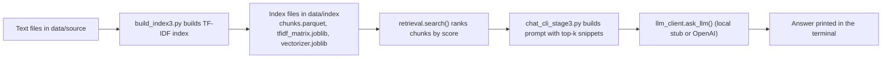

# RAG Mini Chat — Stage 3

Stage 3 is the “tunable” version of the RAG Mini Chat.

Stages 1–2 let you chat over a small set of FAQ-style `.txt` files.  
Stage 3 keeps the same idea, but adds:

- A configurable retrieval pipeline (`config.yml`)
- Scores and debugging info for each retrieved chunk
- A pluggable LLM client (`llm_client.py`) that can use:
  - a **local stub** (no API key required), or  
  - a **real OpenAI model** when an API key is available

---

## Project structure

```text
RAG Mini Chat (Stage 3)/
├─ data/
│  ├─ source/                # Your knowledge base (.txt files)
│  │  ├─ product_overview.txt
│  │  ├─ Special_Order_Overview.txt
│  │  └─ support_faq.txt
│  └─ index/                 # Built by build_index3.py
│     ├─ chunks.parquet
│     ├─ tfidf_matrix.joblib
│     └─ vectorizer.joblib
├─ rag/
│  ├─ build_index3.py        # Build / refresh the TF–IDF index
│  ├─ retrieval.py           # search() + scoring and ranking
│  ├─ chat_cli_stage3.py     # Interactive CLI chat
│  ├─ llm_client.py          # Stub or OpenAI-backed LLM client
│  ├─ config.yml             # Retrieval / display / LLM settings
│  └─ __init__.py
└─ README.md                 # (this file)

```
# Mermaid (High-Level Flow) 


# Steps Involved

Data Source:

- product_overview.txt

- Special_Order_Overview.txt

- support_faq.txt

Indexing:

- The build_index3.py script generates a TF-IDF index for the documents.

- This script processes the documents in data/source and stores the output in the data/index folder (chunks.parquet, tfidf_matrix.joblib, and vectorizer.joblib).

- Retrieval & Ranking:

- The retrieval.search() function ranks the chunks by score based on the similarity between the user query and document content.

Chat CLI:

- The chat_cli_stage3.py script builds the prompt using the top-k retrieved snippets from the indexed documents.

Answer Generation:

- The llm_client.ask_llm() function processes the query using either a local model or the OpenAI API, and provides the final answer grounded in the retrieved documents.

Key Features:

- Document Indexing: Multi-document indexing with TF-IDF.

- Improved Retrieval: Contextually relevant ranking of snippets.

- Local or OpenAI Integration: Local stub (for testing) or OpenAI API integration for generating answers.

- Grounded Answers: Answers are based on the content retrieved from indexed documents.

# Running the Project

Set Up Environment:

- Install dependencies: pip install -r requirements.txt

- Ensure that you have the necessary API keys for OpenAI (if using OpenAI API).

Indexing Documents:

- Run python build_index3.py to index the documents in the data/source directory.

Chat CLI Interaction:

- Run python chat_cli_stage3.py to interact with the chatbot.

- Ask questions and get grounded responses from the documents.
