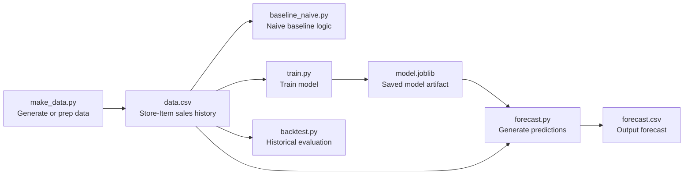

# Store-Item Sales Forecasting

A lightweight, end-to-end **time-series forecasting** project that trains a simple baseline model on **store × item** daily sales data, runs a **backtest**, and generates a **future forecast** output file. Designed to be small, reproducible, and easy to demo.

---

## What this project does

- Builds (or loads) a tabular daily sales dataset at the **store-item-date** level
- Trains a baseline forecasting model and saves it as a reusable artifact (`model.joblib`)
- Evaluates performance with a simple **backtest**
- Generates a forecast file (`forecast.csv`) you can use for reporting or dashboards

---

## Architecture (Mermaid)



---

## Project structure

```
Store-Item Sales Forecasting/
├─ make_data.py          # Create/prep dataset (often synthetic or cleaned)
├─ data.csv              # Historical sales data (input)
├─ baseline_naive.py     # Naive baseline (e.g., last value, moving avg, seasonal naive)
├─ train.py              # Train and persist model artifact
├─ model.joblib          # Saved trained model
├─ backtest.py           # Backtesting/evaluation script
├─ forecast.py           # Generate future forecasts using model + rules
└─ forecast.csv          # Forecast output (predictions)
```

---

## Requirements

- Python 3.10+ recommended
- Typical libraries used in this workflow:
  - `pandas`, `numpy`
  - `scikit-learn`
  - `joblib`

Install dependencies (example):

```bash
pip install -r requirements.txt
# or
pip install pandas numpy scikit-learn joblib
```

---

## Quickstart

### 1) Create or refresh the dataset

If your workflow is synthetic or you need to regenerate data:

```bash
python make_data.py
```

This should produce/update:
- `data.csv`

### 2) Train a model

```bash
python train.py
```

This should produce/update:
- `model.joblib`

### 3) Run a backtest

```bash
python backtest.py
```

Expected outcome:
- prints metrics to the terminal (and/or writes results depending on your implementation)

### 4) Generate a forecast

```bash
python forecast.py
```

This should produce/update:
- `forecast.csv`

---

## Input and output files

### `data.csv` (input)

Typical columns (examples):
- `date`
- `store_id`
- `item_id`
- `sales`

If your file uses different names, update the scripts accordingly.

### `forecast.csv` (output)

Typical columns (examples):
- `date` (forecast horizon date)
- `store_id`
- `item_id`
- `forecast` (predicted sales)

---

## Backtesting approach (high level)

`backtest.py` commonly:
- splits historical data into **train** and **validation** windows
- generates predictions using:
  - a naive baseline (`baseline_naive.py`), and/or
  - the trained model (`model.joblib`)
- reports metrics such as MAE / RMSE / MAPE (depending on how you implemented it)

---

## Notes / assumptions

- This project is intentionally simple: it prioritizes **clarity and reproducibility** over complex modeling.
- Forecast quality depends heavily on:
  - the realism and coverage of `data.csv`
  - seasonality handling (weekly patterns are common in retail)
  - feature engineering (lags, rolling means, store/item effects)

---

## License
MIT
