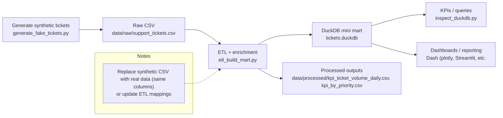

# Support Ticket Analytics (Ops KPIs + NLP)

Small analytics playground for IT/support tickets.

This project shows an end-to-end path from **raw tickets → curated “mini mart” (DuckDB) → KPI queries for reporting/dashboards**, with optional light text analysis for issue themes.

## What this project demonstrates

- **Data generation**: create a realistic synthetic support ticket CSV (or swap in a real export).
- **ETL + data modeling**: clean/enrich ticket data and build a **DuckDB** mini data mart.
- **Ops KPIs**: ticket volume, backlog, simple SLA proxy measures, and trend slices.
- **(Optional) NLP basics**: simple keyword/topic and sentiment-style signals for recurring issues.

---

## High-level architecture (Mermaid)



If Mermaid fails to render in your viewer, it is usually due to older Mermaid versions. Try GitHub rendering, or keep labels simple.

---

## Project structure

```text
Support Ticket Analytics/
├─ data/
│  ├─ raw/          # Source CSV files (generated or downloaded)
│  └─ processed/    # Outputs from ETL (cleaned / enriched CSVs)
├─ etl_build_mart.py
├─ generate_fake_tickets.py
├─ inspect_duckdb.py
├─ requirements.txt
├─ tickets.duckdb
|─ app.py           #(optional) Dash (plotpy app for dashboard)
|- streamlit_app.py #(optional) Streamlit app for dashboard
└─ README.md
```

---

## Setup

```bash
# 1) Create a virtual environment (recommended)
python -m venv .venv
source .venv/bin/activate        # Windows: .venv\\Scripts\\activate

# 2) Install dependencies
pip install -r requirements.txt
```

---

## How to run

### 1) Generate synthetic tickets

```bash
python generate_fake_tickets.py
```

Output:

- `data/raw/support_tickets.csv`

Notes:

- You can **delete** and re-generate `data/raw/support_tickets.csv` whenever you want.
- If you replace it with a real export, keep the expected columns or update the ETL script accordingly.

### 2) Build the DuckDB mini mart + processed outputs

```bash
python etl_build_mart.py
```

This step will:

- Read `data/raw/support_tickets.csv`
- Clean and enrich the ticket data (e.g., normalize fields, derive time features, compute simple SLA/backlog signals)
- Write:
  - `tickets.duckdb` (DuckDB database)
  - processed CSVs into `data/processed/`

Why it might take time:

- Larger CSVs mean more rows to parse, type-infer, and transform. CSV parsing and grouping can take longer as file size grows.

### 3) Inspect the mart (optional)

```bash
python inspect_duckdb.py
```

You should see:

- A list of tables (for example `fact_tickets`)
- A small sample printed to the console

---

## KPIs you can compute (examples)

Typical operational KPIs you can build from a ticket mart:

- **Ticket volume**: tickets created per day/week, by queue/category
- **Backlog**: open tickets over time; aging buckets (e.g., > 7 days open)
- **SLA proxy**: percent resolved within X hours/days (depending on your schema)
- **Ops health**: mean/median time-to-first-response, mean/median time-to-resolution
- **Text themes** (optional): top keywords, recurring phrases by category/product

---

## Recommended screenshots for your portfolio (4)

Capture these four screenshots and add them to your portfolio page:

1. **Synthetic raw data preview**
   - Show the first ~20 rows of `data/raw/support_tickets.csv` in a spreadsheet/editor.
   - Filename suggestion: `01_raw_tickets_preview.png`

2. **DuckDB mart tables**
   - Show `tickets.duckdb` opened in a DB viewer (or output from `inspect_duckdb.py`) listing tables and a sample.
   - Filename suggestion: `02_duckdb_tables_and_sample.png`

3. **KPI query output**
   - Show a query result (e.g., daily ticket volume, backlog, SLA proxy) either in console or DuckDB UI.
   - Filename suggestion: `03_kpi_query_result.png`

4. **Dashboard / trend visualization**
   - A simple chart: volume by day, backlog trend, top categories, or themes.
   - Filename suggestion: `04_dashboard_or_trends.png`

---

## Troubleshooting

### Mermaid diagram does not render

- Confirm your Markdown viewer supports Mermaid.
- GitHub typically renders Mermaid diagrams in README files.
- Keep node labels simple; avoid unescaped special characters.

### “File not found” errors

- Ensure `data/raw/support_tickets.csv` exists (run `generate_fake_tickets.py` first).
- Ensure you are running commands from the project root folder.

### Slow ETL on large CSVs

- This is normal: more rows mean more parsing + transformations.
- Optional improvements (future):
  - Use DuckDB to read CSVs directly and push down filtering/aggregation.
  - Predefine column types to avoid expensive inference.
  - Partition raw data by date for incremental runs.

---

## License

Personal portfolio project. Use freely for learning and demos.
