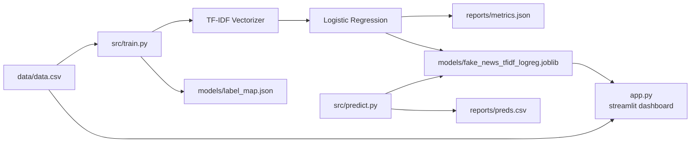

# Fake News Learning with Machine Learning

A small, reproducible NLP classification project that predicts whether a text snippet is **Real (0)** or **Fake (1)** using a scikit-learn baseline (TF-IDF + Logistic Regression).

> Model quality depends heavily on dataset size and cleanliness. This repo emphasizes a clean, portfolio-ready workflow: training, evaluation, and batch prediction.

## Project structure

```text
fake-news-ml/
  data/
    data.csv
  models/
    fake_news_tfidf_logreg.joblib
    label_map.json
  reports/
    metrics.json
    preds.csv
  src/
    train.py
    predict.py
  requirements.txt
  README.md
```

## Data format

`data/data.csv` must contain:

- `text`: the input text
- `label`: `0` = Real, `1` = Fake

Example:

```csv
text,label
"The capital of France is Paris",0
"Sharks are mammals",1
```

## Workflow diagram



## Setup

```bash
pip install -r requirements.txt
```

## Train

```bash
python src/train.py --data data/data.csv --text-col text --label-col label --outdir models --reportdir reports
```

## Predict

Single text:

```bash
python src/predict.py --model models/fake_news_tfidf_logreg.joblib --text "Some headline here"
```

Batch CSV prediction (adds `pred_label` and `pred_proba_fake`):

```bash
python src/predict.py --model models/fake_news_tfidf_logreg.joblib --input data/data.csv --output reports/preds.csv
```

## Tech stack

- Python 3.10+
- pandas
- scikit-learn
- joblib
