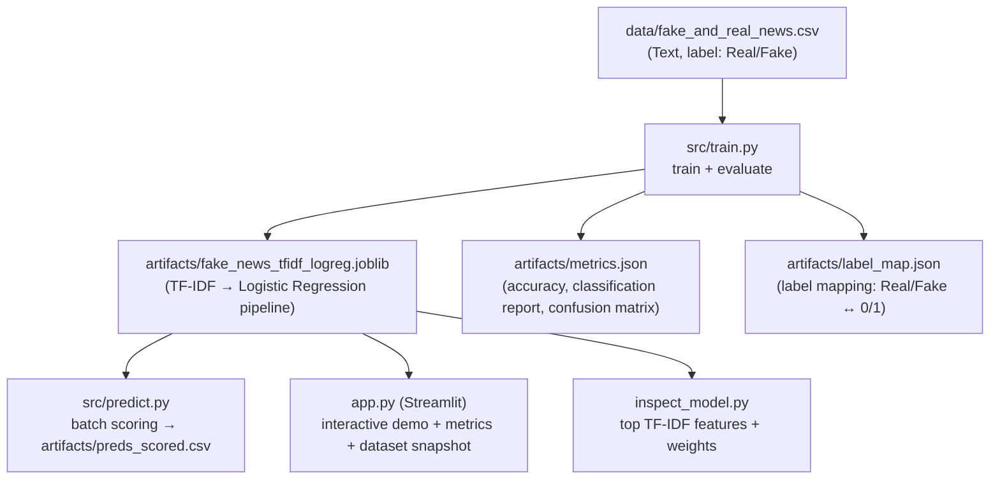

# Fake News Learning with Machine Learning (Stage 1)

Baseline NLP text classifier using **TF‑IDF + Logistic Regression**. This stage focuses on a clean, reproducible workflow:
**data → train → metrics → saved model artifact → predictions → Streamlit demo**.

**Dataset source:** Kaggle — Fake News Detection  
https://www.kaggle.com/datasets/vishakhdapat/fake-news-detection

---

## What this project does (Stage 1)

- Loads a labeled dataset of news text (`Real` vs `Fake`)
- Trains a baseline model: **TF‑IDF vectorizer → Logistic Regression**
- Evaluates performance and writes metrics to `artifacts/metrics.json`
- Saves the trained model pipeline to `artifacts/fake_news_tfidf_logreg.joblib`
- Optionally generates a scored CSV output (`artifacts/preds.csv` / `artifacts/preds_scored.csv`)
- Provides:
  - `inspect_model.py` to view **top indicative features**
  - `app.py` Streamlit dashboard to demo predictions + metrics + dataset snapshot

This is a **Stage 1 baseline**—useful for demonstrating fundamentals (feature engineering, evaluation, artifacts, reproducibility).

---

## Project structure

```
Fake News Learning with Machine Learning (Stage 1)/
├─ app.py
├─ inspect_model.py
├─ README.md
├─ requirements.txt
├─ data/
│  └─ fake_and_real_news.csv
├─ artifacts/
│  ├─ fake_news_tfidf_logreg.joblib
│  ├─ label_map.json
│  ├─ metrics.json
│  └─ preds.csv
└─ src/
   ├─ train.py
   └─ predict.py
```

---

## Pipeline overview (Mermaid)



---

## Setup

### Create and activate a virtual environment

**macOS / Linux**
```bash
python3 -m venv .venv
source .venv/bin/activate
```

**Windows (PowerShell)**
```powershell
python -m venv .venv
.\.venv\Scripts\Activate.ps1
```

### Install dependencies

```bash
python -m pip install --upgrade pip
python -m pip install -r requirements.txt
```

If `pip` is broken inside the venv:
```bash
python -m ensurepip --upgrade
python -m pip install --upgrade pip
```

---

## Train the baseline

Expected columns for the Kaggle file:
- **Text column:** `Text`
- **Label column:** `label` (values: `Real` or `Fake`)

```bash
python src/train.py   --data data/fake_and_real_news.csv   --text-col Text   --label-col label
```

Outputs are written under `artifacts/` (model + metrics + label map).

---

## Batch scoring

```bash
python src/predict.py   --model artifacts/fake_news_tfidf_logreg.joblib   --data data/fake_and_real_news.csv   --text-col Text   --out artifacts/preds_scored.csv
```

One-off scoring:
```bash
python src/predict.py   --model artifacts/fake_news_tfidf_logreg.joblib   --text "Breaking: Scientists discover..."
```

---

## Streamlit dashboard

```bash
streamlit run app.py
```

The dashboard typically includes:
- Interactive prediction demo
- Metrics summary (from `artifacts/metrics.json`)
- Optional prediction report table
- Optional interpretability table (top features)
- Dataset snapshot (+ optional dataset download button)

---

## Common issue: scikit-learn version mismatch

If you see warnings/errors like:
- `InconsistentVersionWarning`
- `'LogisticRegression' object has no attribute 'multi_class'`

You likely trained the model under a different scikit‑learn version than the one loading it.

**Recommended fix:** retrain in the same venv you run Streamlit/predict with:
```bash
python src/train.py --data data/fake_and_real_news.csv --text-col Text --label-col label
```

---

## Stage 1 limitations

This is intentionally a baseline:
- TF‑IDF + Logistic Regression is fast and interpretable, but can miss nuance/long context.
- Results depend on dataset quality and split strategy.
- Real systems require stronger validation, leakage checks, and robustness testing.
---
