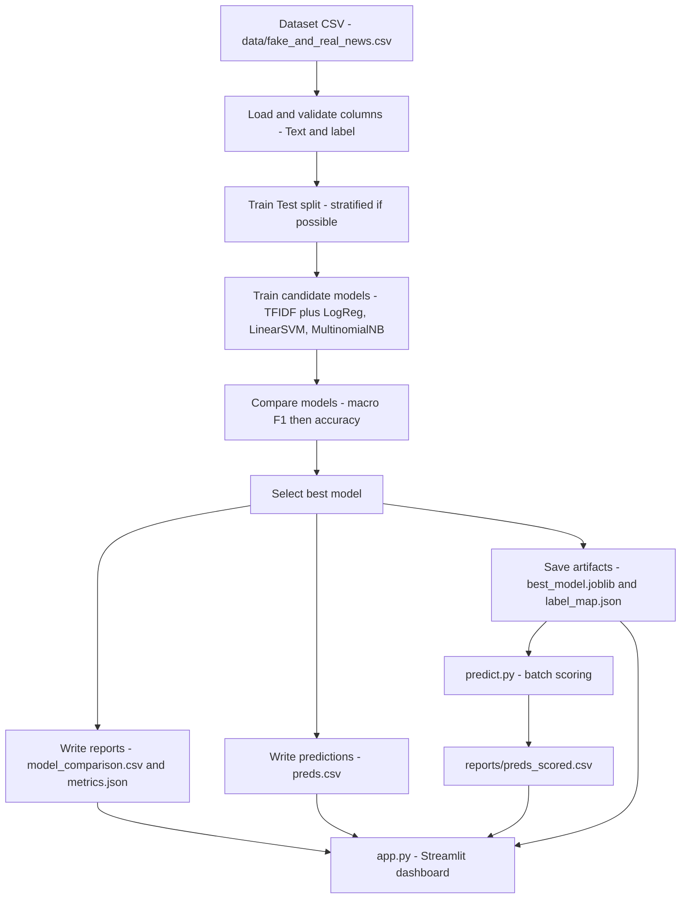

# Fake News Learning with Machine Learning - Stage 2

Stage 2 upgrades the baseline into a **model comparison + reporting** workflow.

## What Stage 2 does
- Loads the dataset from `data/fake_and_real_news.csv`
- Trains and compares 3 TF-IDF baselines:
  - Logistic Regression
  - Linear SVM
  - Multinomial Naive Bayes
- Selects the best model by **macro F1**, then **F1 Fake**, then **accuracy**
- Saves the best model and evaluation artifacts for a portfolio-ready demo

## Project layout
```
Fake News Learning with Machine Learning (Stage 2)/
  artifacts/
    best_model.joblib
    label_map.json
  data/
    fake_and_real_news.csv
  reports/
    metrics.json
    model_comparison.csv
    preds.csv
    preds_scored.csv        # optional, from predict.py
  src/
    train.py
    predict.py
    evaluate.py
  app.py
  requirements.txt
  README.md
```

## Run
### 1) Create and activate a virtual environment
```bash
python -m venv .venv
# Windows
.venv\Scripts\activate
# macOS or Linux
source .venv/bin/activate
```

### 2) Install dependencies
```bash
pip install -r requirements.txt
```

### 3) Train and select the best model
```bash
python src/train.py --data data/fake_and_real_news.csv --text-col Text --label-col label
```

### 4) Batch scoring over the full dataset
```bash
python src/predict.py --model artifacts/best_model.joblib --data data/fake_and_real_news.csv --text-col Text --label-col label --out reports/preds_scored.csv
```

### 5) Run the Streamlit dashboard
```bash
streamlit run app.py
```

## Outputs you should see
- `reports/model_comparison.csv` - ranked baseline models with scores
- `reports/metrics.json` - best model metrics and configuration
- `reports/preds.csv` - test split predictions for the best model
- `artifacts/best_model.joblib` - serialized scikit-learn pipeline
- `artifacts/label_map.json` - mapping of label id to display name

## Mermaid diagram - Stage 2 pipeline


## Notes
- If you see scikit-learn version mismatch warnings when loading a joblib model, retrain using the **same venv** that runs Streamlit and prediction.
- For reproducibility, keep `requirements.txt` pinned to the environment used for training.
