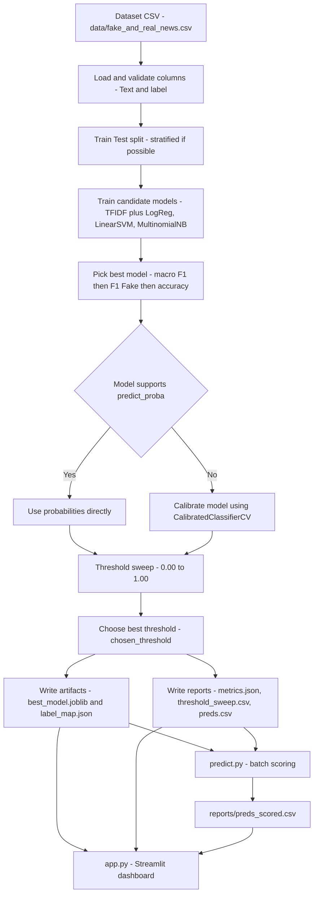

# Fake News Learning with Machine Learning — Stage 3

This stage extends Stage 2 by adding **probability calibration** (when needed) and a **threshold sweep** to select a better decision threshold for the “Fake” class.

## Quickstart

```bash
# 1) Train + evaluate + threshold tuning
python src/train.py --data data/fake_and_real_news.csv --text-col Text --label-col label

# 2) Optional: batch score the full dataset (uses chosen_threshold from reports/metrics.json when available)
python src/predict.py   --model artifacts/best_model.joblib   --metrics reports/metrics.json   --data data/fake_and_real_news.csv   --text-col Text   --label-col label   --out reports/preds_scored.csv

# 3) Streamlit dashboard
streamlit run app.py
```

## Mermaid diagram: Stage 3 pipeline

Render this in GitHub (or any Mermaid-enabled Markdown viewer):



## Outputs

Typical outputs after a full Stage 3 run:

- `artifacts/best_model.joblib`
- `artifacts/label_map.json`
- `reports/metrics.json` (includes `chosen_threshold` when generated)
- `reports/threshold_sweep.csv` (threshold vs metrics)
- `reports/model_comparison.csv`
- `reports/preds.csv` / `reports/preds_scored.csv`
