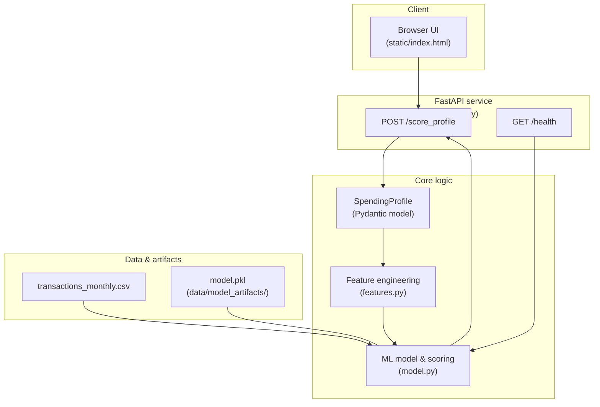

# Finance Spending Coach — Stage 1 (ML API + UI)

Stage 1 of a small **FastAPI + scikit-learn** project that scores a monthly spending profile for **overspending risk** and returns friendly coaching suggestions.

This stage focuses on:

- Generating synthetic finance data
- Training a simple classifier on monthly spending aggregates
- Exposing a clean FastAPI endpoint to score a spending profile
- Providing a minimal HTML front-end for non-technical users
- Packaging everything into a Docker image

> **Stage 2 (planned):** Add a lightweight RAG / knowledge-based “coach” layer that pulls budgeting tips and explanations from a small curated corpus. Stage 1 lays the foundation: data, model, API, and UI.

---

## Features (Stage 1)

- Synthetic transaction generator for toy finance data
- Training script that builds a logistic-regression classifier from monthly spending aggregates
- FastAPI backend with:
  - `GET /health` – lightweight health check
  - `POST /score_profile` – accepts a JSON spending profile and returns risk + suggestions
- Static HTML UI (`app/static/index.html`) that calls the API and renders results
- Dockerfile to build and run the whole app as a single container

---

## High-level architecture (Stage 1)



---

## Project structure

```text
Finance-spending-coach/
├─ app/
│  ├─ static/
│  │  └─ index.html          # Small browser UI that calls /score_profile
│  ├─ __init__.py
│  ├─ api.py                 # FastAPI routes and startup
│  ├─ features.py            # FEATURE_COLUMNS and profile_to_features()
│  ├─ model.py               # Training, model loading, scoring
│  └─ schemas.py             # Pydantic models (SpendingProfile, ScoreResponse)
├─ data/
│  ├─ transactions_raw.csv       # Row-level synthetic transactions
│  └─ transactions_monthly.csv   # Monthly aggregates with overspend_flag
├─ scripts/
│  └─ generate_fake_transactions.py  # Build synthetic CSVs from scratch
├─ Dockerfile
├─ requirements.txt
└─ README.md                 # This file
```

Stage 1 uses only local CSVs and an in-container model file; no external DB or cloud services are required.

---

## 1. Setup & installation (local)

### 1.1. Create and activate a virtual environment

From the project root:

```bash
python -m venv .venv
source .venv/bin/activate    # Windows: .venv\Scripts\activate
pip install --upgrade pip
pip install -r requirements.txt
```

### 1.2. Generate synthetic data

If you want to recreate the data from scratch:

```bash
python scripts/generate_fake_transactions.py
```

This will create:

- `data/transactions_raw.csv`
- `data/transactions_monthly.csv`

These files are used by `app/model.py` to train the overspending classifier.

---

## 2. Running the API locally (Stage 1)

From the project root (with the virtual environment activated):

```bash
uvicorn app.api:app --reload
```

Then open:

- Swagger / OpenAPI docs: <http://127.0.0.1:8000/docs>
- ReDoc docs (optional): <http://127.0.0.1:8000/redoc>
- Simple HTML front-end: <http://127.0.0.1:8000/>

On startup:

- The app will attempt to load `data/model_artifacts/model.pkl`.
- If it does not exist or is invalid, it will automatically train a new model from `data/transactions_monthly.csv` and save the artifact.

---

## 3. Using the service

### 3.1. Via the HTML front-end

1. Visit <http://127.0.0.1:8000/> while the server is running.
2. Enter monthly income and category-level spending:
   - Housing
   - Food
   - Transport
   - Shopping
   - Entertainment
   - Other
   - (Optional) savings rate (% of income you aim to save)
3. Click **Score profile**.
4. The UI will display:
   - Overspend probability (0–1)
   - Risk level: `low`, `medium`, or `high`
   - A small list of coaching suggestions.

The front-end sends a `POST` to `/score_profile` with a JSON body that matches `SpendingProfile`.

### 3.2. Via Swagger UI

1. Visit <http://127.0.0.1:8000/docs>.
2. Expand the **POST /score_profile** operation.
3. Click **Try it out** and edit the example JSON, for example:

```json
{
  "income": 5000,
  "housing": 1800,
  "food": 600,
  "transport": 250,
  "shopping": 400,
  "entertainment": 250,
  "other": 150,
  "savings_rate": 0.1
}
```

4. Click **Execute** to see the JSON response.

### 3.3. Example JSON response

```json
{
  "overspend_probability": 0.62,
  "risk_level": "high",
  "suggestions": [
    "High risk of overspending this month.",
    "Set a hard cap on discretionary spending (shopping / entertainment).",
    "You are not saving at all—consider a no-spend week."
  ]
}
```

(The exact numbers depend on the model fitted to your synthetic data.)

---

## 4. Building & running with Docker

Stage 1 also supports running as a single Dockerized service. This bundles:

- The FastAPI app
- The training & scoring code
- All required Python dependencies

### 4.1. Build the image

From the project root:

```bash
docker build -t finance-spending-coach .
```

### 4.2. Run the container

```bash
docker run --rm -p 8000:8000 finance-spending-coach
```

Then open the same URLs as before:

- Swagger: <http://127.0.0.1:8000/docs>
- HTML front-end: <http://127.0.0.1:8000/>

The container runs `uvicorn` and will train/load the model on startup exactly as in local mode.

---

## 5. Stage roadmap

This repository is designed as a multi-stage learning / portfolio project.

### Stage 1 (this README)

- Synthetic finance data generator
- Simple overspending classifier (logistic regression)
- FastAPI service with `/score_profile`
- Minimal HTML UI + Swagger testing
- Docker packaging

### Stage 2 (planned – RAG / assistant layer)

- Add a small **knowledge base** of budgeting / spending best practices (Markdown, PDFs, or HTML notes)
- Build an **embedding + retrieval** layer over that knowledge
- Extend the API to return:
  - Model-based risk probabilities
  - RAG-based, doc-grounded explanations and tips
- Optionally expose a simple chat-like UI where the user can ask:
  - “Why is my risk high?”
  - “What should I cut first to save $200/month?”

---

## 6. Tech stack (Stage 1)

- **Backend:** FastAPI, Uvicorn
- **Modeling:** scikit-learn, pandas, numpy
- **Validation:** Pydantic v2
- **Packaging:** Docker (Python 3.11-slim base image)
- **Front-end:** Static HTML + small amount of JavaScript (`fetch`)

---
