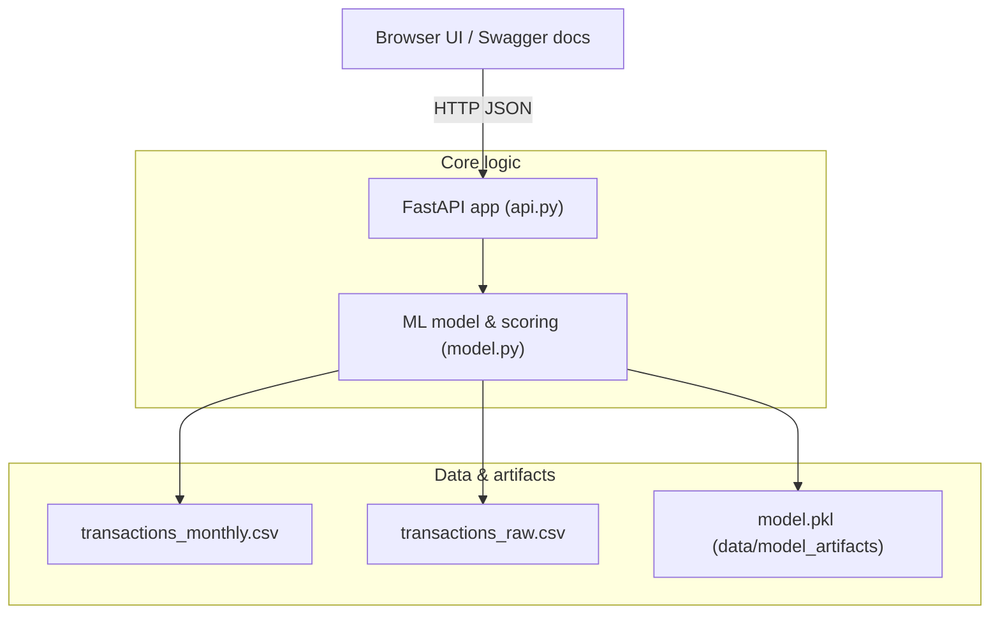

# Finance Spending Coach — Stage 1 (Core API)

Stage 1 is a small **FastAPI + scikit-learn** service that scores a monthly spending profile for **overspending risk**. It trains a simple logistic regression model on synthetic transaction data and exposes a JSON API (plus an optional minimal HTML UI).

Stages 2 and 3 build on this:

- **Stage 2:** add a nicer front-end and “Ask AI coach” entry point.
- **Stage 3:** add a small local knowledge base + retrieval layer (RAG-style coach).

This folder is **Stage 1 only** – the minimal ML scoring service.

---

## Folder layout

```text
Finance-spending-coach (Stage 1)/
├── app/
│   ├── static/
│   │   └── index.html              # Optional simple front-end (served at "/")
│   ├── __init__.py
│   ├── api.py                     # FastAPI routes
│   ├── features.py                # Feature engineering helpers
│   ├── model.py                   # Train, load, and score the ML model
│   └── schemas.py                 # Pydantic request/response models
│
├── data/
│   ├── model_artifacts/
│   │   └── model.pkl              # Trained logistic regression (created on first run)
│   ├── transactions_monthly.csv   # Aggregated monthly profiles (training data)
│   └── transactions_raw.csv       # Row-level synthetic transactions
│
├── scripts/
│   └── generate_fake_transactions.py  # Utility to regenerate synthetic CSVs
│
├── Dockerfile
├── README.md
└── requirements.txt
```

---

## How it works

1. **Synthetic data**  
   - `scripts/generate_fake_transactions.py` creates:
     - `data/transactions_raw.csv` – individual fake transactions.
     - `data/transactions_monthly.csv` – monthly aggregates with an `overspend_flag`.

2. **Model training & artifacts**  
   - `app/model.py` reads `transactions_monthly.csv`, engineers features (via `features.py`),
     trains a **logistic regression** classifier, and saves it to:
     - `data/model_artifacts/model.pkl`.
   - On startup, if `model.pkl` does not exist or fails to load, the app will **retrain**.

3. **API layer**  
   - `app/api.py` defines a FastAPI app with Pydantic models from `schemas.py`.
   - Requests are validated, converted to feature vectors, and passed into the model.
   - Responses return:
     - `overspend_probability` (0–1),
     - a simple `risk_level` (`low | medium | high`),
     - a list of **rule-based suggestions**.

4. **Optional UI**  
   - `app/static/index.html` is served at `/` and calls the JSON API under the hood.
   - Swagger / OpenAPI docs are still available at `/docs`.

---

## Architecture (Stage 1)



---

## Running locally (Python)

From the **Stage 1** root directory:

1. (Optional) create and activate a virtual environment:

   ```bash
   python -m venv .venv
   source .venv/bin/activate   # macOS / Linux
   # or: .venv\Scripts\activate  # Windows
   ```

2. Install dependencies:

   ```bash
   pip install -r requirements.txt
   ```

3. Generate synthetic data (only needed if the CSVs are missing or you want fresh data):

   ```bash
   python scripts/generate_fake_transactions.py
   ```

4. Run the API:

   ```bash
   uvicorn app.api:app --reload
   ```

5. Open in the browser:

   - Main UI (if you keep `index.html` wired up):  
     `http://127.0.0.1:8000/`
   - Swagger / OpenAPI docs:  
     `http://127.0.0.1:8000/docs`

On first startup, the service will train the logistic regression model and write
`data/model_artifacts/model.pkl`.

---

## Running via Docker

From the **Stage 1** root:

```bash
# Build the image
docker build -t finance-spending-coach-stage1 .

# Run the container
docker run --rm -p 8000:8000 finance-spending-coach-stage1
```

Then browse to `http://localhost:8000/docs` (and `/` for the simple UI if desired).

---

## API endpoints

### `GET /health`

Simple health check.

**Response:**

```json
{
  "status": "ok"
}
```

### `POST /score_profile`

Scores a single monthly spending profile.

**Request body (JSON):**

```json
{
  "income": 4000,
  "housing": 1400,
  "food": 600,
  "transport": 250,
  "shopping": 300,
  "entertainment": 200,
  "other": 150,
  "savings_rate": 0.10
}
```

> Note: `savings_rate` is a rate in **[0, 1]**, not a percent.

**Response (example):**

```json
{
  "overspend_probability": 0.18,
  "risk_level": "medium",
  "suggestions": [
    "Your spending is a bit tight; review non-essential categories.",
    "Try trimming 5–10% from shopping or entertainment.",
    "Aim to build at least a 10% savings buffer."
  ]
}
```

---

## How Stage 1 fits into the full project

- **Stage 1 (this folder):** core ML scoring service + basic UI.
- **Stage 2:** reuses this model, but adds a more polished front-end and a “coach” endpoint.
- **Stage 3:** extends the coach with a small local knowledge base and retrieval layer (RAG flavor).

This README is focused only on the **Stage 1** building block.
