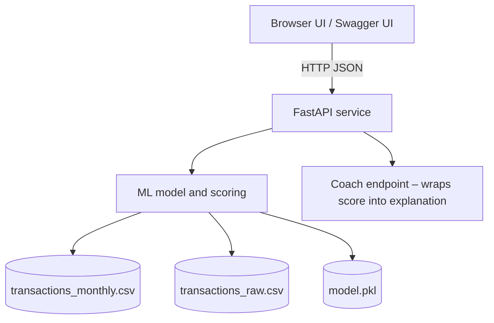

# Finance Spending Coach — Stage 2 (UI + Coach API)

Stage 2 builds on the Stage 1 API by:

- Keeping the same **overspending risk model** and `/score_profile` endpoint.
- Adding a **browser UI** (`index.html`) served by FastAPI.
- Introducing a **coach endpoint** `/coach_profile` that wraps the model output in more narrative guidance (no KB/RAG yet).
- Providing a **Dockerfile** so the whole app can be run as a self‑contained container.

> This is a good “full‑stack but small” demo: Python + FastAPI backend, minimal HTML/JS front‑end, and a persisted ML model artifact.

---

## Repository layout (Stage 2)

```text
app/
  static/
    index.html          # Front-end single page (form + JS calls to API)
  __init__.py
  api.py                # FastAPI app, routes, and static hosting
  features.py           # Feature engineering for the model
  model.py              # Train / load / score overspending model
  rag.py                # Placeholder for future coach logic (no KB in Stage 2)
  schemas.py            # Pydantic request/response models

data/
  model_artifacts/
    model.pkl           # Fitted scikit-learn pipeline (StandardScaler + LogisticRegression)
  transactions_monthly.csv  # Monthly synthetic features (+ overspend_flag)
  transactions_raw.csv      # Raw-ish transaction rows used to build monthly features

scripts/
  generate_fake_transactions.py  # Helper to regenerate synthetic CSVs

Dockerfile
requirements.txt
README.md                 # This file
```

---

## Architecture (Stage 2 only)



**Flow:**

1. The browser UI (or Swagger) sends a JSON payload describing a monthly spending profile.
2. FastAPI validates it against `SpendingProfile` (Pydantic) from `schemas.py`.
3. `model.py` converts the profile into numeric features (`features.py`), runs the scikit‑learn pipeline, and returns the overspending probability.
4. `/score_profile` responds with probability + simple suggestions (used for both Swagger and the UI).
5. `/coach_profile` (Stage 2) wraps the score and suggestions into a human‑readable explanation string and returns it to the UI.

---

## Running locally (no Docker)

From the Stage 2 project root:

```bash
python -m venv .venv
source .venv/bin/activate  # Windows: .venv\Scripts\activate
pip install --upgrade pip
pip install -r requirements.txt
```

### 1. (Optional) Regenerate synthetic data

If you want to rebuild the CSVs or tweak their parameters:

```bash
python scripts/generate_fake_transactions.py
```

`model.py` is written to train a model lazily if `data/model_artifacts/model.pkl` is missing or incompatible. In Stage 2, a pre‑trained `model.pkl` is already committed, so you can run without retraining.

### 2. Start the FastAPI app

```bash
uvicorn app.api:app --reload
```

Then:

- UI front‑end: http://127.0.0.1:8000/
- API docs (Swagger): http://127.0.0.1:8000/docs

---

## Running via Docker

From the Stage 2 project root:

```bash
# Build image
docker build -t finance-spending-coach .

# Run container
docker run --rm -p 8000:8000 finance-spending-coach
```

Then open:

- UI: http://127.0.0.1:8000/
- Swagger: http://127.0.0.1:8000/docs

The image:

- Uses `python:3.11-slim` as a base.
- Installs `requirements.txt`.
- Copies the app, data, and artifacts into `/app`.
- Runs `uvicorn app.api:app --host 0.0.0.0 --port 8000`.

---

## API surface (Stage 2)

### `GET /health`

Simple healthcheck; returns `{"status": "ok"}` if the service is ready.

### `POST /score_profile`

Input body (simplified):

```json
{
  "income": 4000,
  "housing": 1400,
  "food": 600,
  "transport": 250,
  "shopping": 300,
  "entertainment": 200,
  "other": 150,
  "savings_rate": 0.10     // 10% as a fraction
}
```

Response (example):

```json
{
  "overspend_probability": 0.42,
  "risk_level": "medium",
  "suggestions": [
    "Your spending is a bit tight; review non-essential categories.",
    "Try trimming 5–10% from shopping or entertainment."
  ]
}
```

This is what drives the **Result** panel in the front‑end.

### `POST /coach_profile`

Stage 2 adds a higher‑level “coach” endpoint that:

- Calls the same scoring logic as `/score_profile`.
- Accepts an **optional free‑text question** from the user.
- Returns a longer explanation string plus the model’s suggestions.

Input body (simplified):

```json
{
  "profile": { ...same as above... },
  "question": "What should I cut first to save $200/month?"
}
```

Response (shape):

```json
{
  "overspend_probability": 0.42,
  "risk_level": "medium",
  "model_suggestions": [...],
  "answer": "For this profile (...), the overspending probability is about 42% (MEDIUM risk). ..."
}
```

In Stage 2 this answer is **template‑based / rule‑driven**, not truly RAG‑grounded yet. Stage 3 will introduce a KB + retrieval layer.

---

## Front‑end behaviour (index.html)

The HTML/JS front‑end:

- Renders an input grid for income + 6 spending categories + savings rate.
- Provides two main actions:
  - **Score my month** – `POST /score_profile`, shows probability, risk level, and a suggestions list.
  - **Ask AI coach** – `POST /coach_profile`, shows a narrative explanation and “coach” text beneath the result.
- Shows a small status chip: `Calls /score_profile or /coach_profile under the hood`.
- Displays error messages inline if any API call fails (e.g. network / validation errors).

This makes Stage 2 suitable as a **live demo page** on a portfolio site: a recruiter can open the URL, tweak sliders/inputs, and see the model + coach responses instantly.

---

## How Stage 2 differs from Stage 1

- **Same dataset** (`transactions_raw.csv`, `transactions_monthly.csv`) and model design.
- **New:** Persistent model artifact in `data/model_artifacts/model.pkl` to avoid training on every startup.
- **New:** `static/index.html` front‑end that calls the API directly.
- **New:** `/coach_profile` endpoint and corresponding UI button (“Ask AI coach”). The coach explanation is still template‑based (no KB yet).

Stage 3 will extend this with:

- A local Markdown knowledge base in `app/kb/`.
- An embedding index in `data/rag_index/`.
- A true RAG‑style coach that grounds its guidance in the KB.
