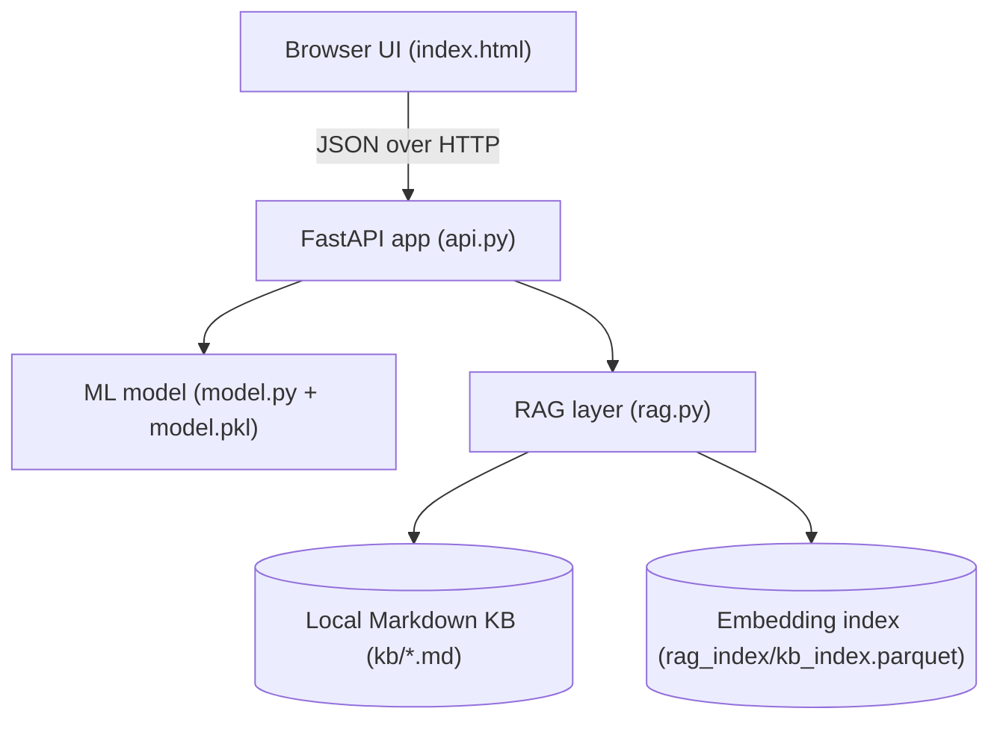

# Finance Spending Coach – Stage 3 (RAG + Local KB)

Stage 3 turns the Finance Spending Coach into a **mini full‑stack ML + RAG demo**:

- A FastAPI backend that scores overspending risk with a small scikit‑learn model.
- A simple HTML/JS front‑end (`index.html`) that calls the API.
- A **local budgeting knowledge base** (Markdown files in `/app/kb`).
- A lightweight **RAG layer** (`rag.py`) that embeds KB docs, retrieves relevant tips, and returns a grounded explanation through `/coach_profile`.

The app remains fully local – no external LLM calls are required.

---

## 1. Project layout

```text
Finance-spending-coach (Stage 3)/
├─ app/
│  ├─ static/
│  │  └─ index.html           # Front-end UI (Stage 3)
│  ├─ api.py                  # FastAPI app + routes
│  ├─ model.py                # Training, loading, and scoring the ML model
│  ├─ features.py             # Feature engineering helpers
│  ├─ schemas.py              # Pydantic schemas (SpendingProfile, ScoreResponse, CoachResponse, etc.)
│  ├─ rag.py                  # Local KB + embeddings + retrieval + coach response
│  └─ agent.py                # (Optional) room for future agent-style logic
│
├─ data/
│  ├─ model_artifacts/
│  │  └─ model.pkl            # Trained logistic regression pipeline
│  ├─ rag_index/
│  │  └─ kb_index.parquet     # Embedding index for the KB
│  ├─ transactions_monthly.csv
│  └─ transactions_raw.csv
│
├─ kb/                        # Local budgeting knowledge base
│  ├─ 01_budgeting_basics.md
│  ├─ 02_category_guidelines.md
│  └─ 03_emergency_fund.md
│
├─ scripts/
│  └─ generate_fake_transactions.py
│
├─ Dockerfile
├─ requirements.txt
└─ README.md                  # This file
```

---

## 2. How Stage 3 extends Stage 2

Compared to Stage 2, Stage 3 adds:

1. A **local KB** of budgeting best practices in `/app/kb`.
2. An **embedding + retrieval layer** (`rag.py`) that:
   - Loads the Markdown files.
   - Builds sentence embeddings.
   - Saves a small Parquet index in `data/rag_index/kb_index.parquet`.
3. A richer `/coach_profile` endpoint that returns:
   - Numerical risk probability and qualitative level (low / medium / high).
   - Model‑based suggestions.
   - A multi‑paragraph, KB‑grounded explanation string.
   - A list of concrete KB tips (`kb_tips`), rendered as bullets in the UI.
4. An updated front‑end (`index.html`) with:
   - “Score my month” button → `/score_profile` only.
   - “Ask AI coach” button → `/coach_profile` (uses both model + KB).
   - A dedicated **AI coach** panel and **Grounded tips from KB** list.

---

## 3. Architecture (Stage 3 – with local KB + RAG)



**Flow:**

1. The browser UI collects the monthly profile and optional question.
2. `/score_profile`:
   - Validates JSON with `SpendingProfile` (Pydantic) from `schemas.py`.
   - Uses `features.py` + `model.py` to compute overspending probability.
   - Returns probability, risk level, and model‑based suggestions.
3. `/coach_profile`:
   - Reuses the same scoring logic.
   - Feeds the profile + question into `rag.py`.
   - `rag.py` retrieves relevant KB snippets and builds:
     - A multi‑paragraph explanation string (`answer`).
     - A list of short, concrete KB tips (`kb_tips`).
   - The UI renders:
     - Result panel (probability + risk level + suggestions).
     - AI coach panel (`answer` split into paragraphs).
     - “Grounded tips from KB” as bullet points.

---

## 4. Running Stage 3

### 4.1. Prerequisites

- Python 3.11+
- (Optional) Docker Desktop, if you want to run everything in a container.

### 4.2. Create virtual environment & install dependencies

From the Stage 3 project root (the directory with `Dockerfile`):

```bash
python -m venv .venv
source .venv/bin/activate  # Windows: .venv\Scripts\activate

pip install --upgrade pip
pip install -r requirements.txt
```

If you ever need to regenerate fake data for `transactions_*.csv`:

```bash
python scripts/generate_fake_transactions.py
```

> The first run of the app will also train the model if `model.pkl` is missing.

### 4.3. Run the API locally (without Docker)

```bash
uvicorn app.api:app --reload
```

- Backend will be available at: http://127.0.0.1:8000
- Swagger docs: http://127.0.0.1:8000/docs
- Front‑end UI: served from `/` → http://127.0.0.1:8000/

If the KB index (`data/rag_index/kb_index.parquet`) does not exist, Stage 3 will build it at startup from the Markdown files under `/app/kb`.

### 4.4. Run everything with Docker

Build the image:

```bash
docker build -t finance-spending-coach:stage3 .
```

Run the container:

```bash
docker run --rm -p 8000:8000 finance-spending-coach:stage3
```

Then open:

- UI: http://127.0.0.1:8000/
- API docs: http://127.0.0.1:8000/docs

---

## 5. API endpoints

### `GET /health`

Simple liveness check.

```json
{ "status": "ok" }
```

### `POST /score_profile`

Input example:

```json
{
  "income": 4000,
  "housing": 1400,
  "food": 600,
  "transport": 250,
  "shopping": 300,
  "entertainment": 200,
  "other": 150,
  "savings_rate": 0.10
}
```

Output (simplified):

```json
{
  "overspend_probability": 0.23,
  "risk_level": "medium",
  "suggestions": [
    "Your spending is a bit tight; review non-essential categories.",
    "Try trimming 5–10% from shopping or entertainment."
  ]
}
```

### `POST /coach_profile`

Input:

```json
{
  "profile": {
    "income": 4000,
    "housing": 1400,
    "food": 600,
    "transport": 250,
    "shopping": 300,
    "entertainment": 200,
    "other": 150,
    "savings_rate": 0.10
  },
  "question": "What should I cut first to save $200/month?"
}
```

Output (shape):

```json
{
  "overspend_probability": 0.87,
  "risk_level": "high",
  "suggestions": [
    "... model-based suggestions ..."
  ],
  "answer": "For this profile ...\n\nYou asked: ...\n\nModel-based suggestions: ...\n\nGrounded tips from the KB include ...",
  "kb_tips": [
    "Restaurants and take-out",
    "Shopping and online orders",
    "Build a $1,000–$2,000 starter emergency fund"
  ]
}
```

- The front‑end:
  - Renders `answer` into multiple paragraphs (split on blank lines).
  - Renders `kb_tips` as bullets under **Grounded tips from KB**.

---
