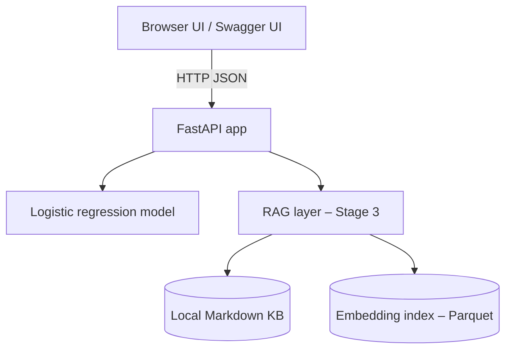

# Finance Spending Coach — Stages 1–3 Overview

Toy end‑to‑end project that grows from a simple ML API into a small RAG‑style “AI coach” with a browser UI and Docker packaging.

> **Goal:** Show a realistic progression from _“train a model + expose an endpoint”_ to _“serve a small product‑like demo with retrieval‑augmented guidance.”_

---

## 1. Stage summary

| Stage | Focus | What it adds | How you use it |
| ----- | ----- | ------------ | -------------- |
| **Stage 1 – Core ML API** | Data + model | Logistic‑regression overspending model, `SpendingProfile` schema, `/score_profile` endpoint, Dockerfile | Call the API from tools / Swagger (`/docs`) or curl; no custom UI. |
| **Stage 2 – Scoring UI** | Product surface | Static HTML/JS front‑end, FastAPI serves `/` and `/static`, buttons that hit `/score_profile` | Open the browser UI and try different budgets; still model‑only suggestions. |
| **Stage 3 – KB + “AI coach”** | RAG / retrieval | Local Markdown knowledge base, embedding index, `rag.py`, `/coach_profile` endpoint, updated UI with “Ask AI coach” panel | Get a model‑based risk score **plus** document‑grounded tips pulled from the local KB. |

Each stage lives in its own folder (e.g. `Finance-spending-coach (Stage 1)`, `Stage 2`, `Stage 3`) but shares the same basic structure:

```text
app/
  api.py        # FastAPI app + routes
  model.py      # training / loading the logistic regression model
  features.py   # feature engineering helpers
  schemas.py    # Pydantic models (SpendingProfile, responses, etc.)
  rag.py        # (Stage 2 stub, Stage 3 fully implemented)
  static/index.html  # UI for Stages 2–3

data/
  transactions_raw.csv
  transactions_monthly.csv
  model_artifacts/
    model.pkl
  rag_index/          # (Stage 3)
    kb_index.parquet

kb/                   # (Stage 3)
  01_budgeting_basics.md
  02_category_guidelines.md
  03_emergency_fund.md

scripts/
  generate_fake_transactions.py

Dockerfile
requirements.txt
```

---

## 2. High‑level architecture



- **Stage 1:** Only `user → api → score` is used. The model returns an overspend probability + basic suggestions.
- **Stage 2:** Adds `static/index.html` as a small front‑end; the browser calls `/score_profile` and renders results.
- **Stage 3:** Extends the path via `rag.py` — the API calls a lightweight retriever over the local KB and returns:
  - Model‑based probability and risk level
  - Document‑grounded “grounded tips from KB”

---

## 3. Common setup

All stages share the same Python dependencies.

```bash
# 1. Create and activate a virtual environment (recommended)
python -m venv .venv
source .venv/bin/activate       # macOS / Linux
# or: .venv\Scripts\activate  # Windows

# 2. Install dependencies
pip install --upgrade pip
pip install -r requirements.txt
```

Generate synthetic training data (only needed once per stage, or if you delete `data/transactions_monthly.csv`):

```bash
python scripts/generate_fake_transactions.py
```

This writes both `transactions_raw.csv` and `transactions_monthly.csv` into `data/` and the model code can then train from it.

---

## 4. Stage 1 – Core ML API

**Folder:** `Finance-spending-coach (Stage 1)`

### What Stage 1 includes

- `SpendingProfile` Pydantic model (`schemas.py`)
- Feature engineering (`features.py`) to turn the profile into numeric features
- Training + serialization of a `LogisticRegression` model (`model.py`)
- FastAPI app with:
  - `GET /health` – simple status check
  - `POST /score_profile` – score a monthly spending profile
- Dockerfile to build and serve the API with Uvicorn

### Run locally

```bash
uvicorn app.api:app --reload
```

Then open:

- Swagger UI: http://127.0.0.1:8000/docs
- Example request body for `/score_profile`:

```json
{
  "income": 4000,
  "housing": 1400,
  "food": 600,
  "transport": 250,
  "shopping": 300,
  "entertainment": 200,
  "other": 150,
  "savings_rate": 0.10
}
```

The response includes:

- `overspend_probability` in `[0, 1]`
- `risk_level` = `"low" | "medium" | "high"`
- `suggestions` – a few rule‑based, model‑driven hints

### Docker

```bash
docker build -t finance-spending-coach:stage1 .
docker run --rm -p 8000:8000 finance-spending-coach:stage1
```

---

## 5. Stage 2 – Scoring UI

**Folder:** `Finance-spending-coach (Stage 2)`

Stage 2 keeps the same back‑end API but adds:

- `/` serving `static/index.html`
- A front‑end form with:
  - Inputs for income and categories
  - “Score my month” and “Reset” buttons
  - A result panel with:
    - Probability + LOW/MEDIUM/HIGH pill
    - Short natural‑language explanation
    - A bullet list of suggestions
- A small banner: “Calls `/score_profile` under the hood”

### Run locally

```bash
uvicorn app.api:app --reload
```

Open the browser UI:

- http://127.0.0.1:8000/

From here, all interaction happens via the front end; no need to touch Swagger unless you want to inspect the schema.

### Docker

```bash
docker build -t finance-spending-coach:stage2 .
docker run --rm -p 8000:8000 finance-spending-coach:stage2
```

Then visit `http://127.0.0.1:8000/` in the browser.

---

## 6. Stage 3 – Local KB + “AI coach” (RAG)

**Folder:** `Finance-spending-coach (Stage 3)`

Stage 3 turns the app into a small RAG‑style demo by adding:

1. **Local knowledge base** (`kb/`)
   - `01_budgeting_basics.md` – general best practices
   - `02_category_guidelines.md` – hints by category (housing, food, transport, etc.)
   - `03_emergency_fund.md` – emergency‑fund guidance

2. **Embedding + retrieval layer** (`rag.py`)
   - Builds a simple embedding index from the Markdown files (stored as `data/rag_index/kb_index.parquet`)
   - On startup, checks for the index and rebuilds if needed
   - At query time, retrieves a few best‑matching snippets and formats them as “grounded tips”

3. **New API endpoint**
   - `POST /coach_profile` with body:

     ```json
     {
       "profile": { ...same fields as Stage 1... },
       "question": "What should I cut first to save $200/month?"
     }
     ```

   - Returns a `CoachResponse` with:
     - `overspend_probability`, `risk_level`
     - `model_suggestions` – same as Stage 1
     - `answer` – natural‑language explanation that references the numbers + question
     - `kb_tips` – short bullet‑style strings grounded in the KB

4. **Updated UI (Stage 3)**

   The front‑end now shows:

   - The original “Result” card (probability + suggestions)
   - An **“AI coach”** card that includes:
     - A paragraph summarizing the profile and risk
     - A paragraph echoing the user’s question (`You asked: ...`)
     - A short explanation of how to interpret the score
     - **Grounded tips from KB**, rendered as a bullet list
   - A free‑text field and “Ask AI coach” button that call `/coach_profile`

### Run locally

```bash
uvicorn app.api:app --reload
```

Open http://127.0.0.1:8000/ and:

1. Enter a monthly budget.
2. Click **Score my month** to populate the Result card.
3. Optionally type a question (e.g. *“How can I save $200/month?”*).
4. Click **Ask AI coach** to see the RAG‑style explanation + KB tips.

### Docker

```bash
docker build -t finance-spending-coach:stage3 .
docker run --rm -p 8000:8000 finance-spending-coach:stage3
```

Then go to `http://127.0.0.1:8000/` in the browser.

---

## 7. How to present this on a portfolio

For a portfolio or GitHub README, you can:

- Link to or embed **screenshots per stage**:
  - Stage 1 – Swagger UI for `/score_profile`
  - Stage 2 – UI showing a “low risk” result
  - Stage 3 – UI showing “high risk” + AI coach answer with “Grounded tips from KB”
- Emphasize the progression:
  - Data → model → API → UI → RAG layer
- Highlight engineering decisions:
  - Typed Pydantic models and schemas
  - Separation of concerns (`features.py`, `model.py`, `rag.py`)
  - Dockerized runtime for easy local demo

This README is intended as the **top‑level summary** that explains how the three stages relate, while each stage folder keeps its own more detailed `README` focused on that step.
