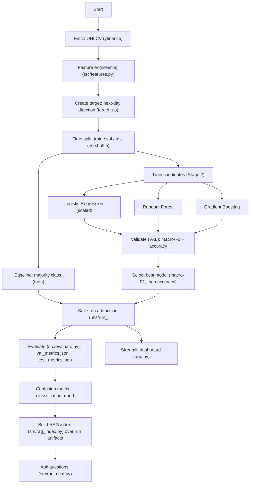

# Next-Day Direction Classifier with RAG (Stage 2)

Stage 2 extends Stage 1 into a **multi-model, multi-stock** workflow with improved features, stronger baselines, evaluation artifacts, a lightweight RAG “run assistant”, and a Streamlit dashboard.

> **Disclaimer:** This is an educational ML project. Not investment advice.

---

## What’s new in Stage 2

- **Multi-stock runs**: train across a list of tickers (e.g., `AAPL`, `EFX`, `MSFT`).
- **Model comparison** on validation set:
  - Logistic Regression (scaled)
  - Random Forest
  - Gradient Boosting
- **Best model selection** by **macro-F1** (then accuracy as tie-breaker).
- **Evaluation artifacts** written per run:
  - `val_metrics.json`, `test_metrics.json`
  - `confusion_matrix_test.png`
  - `classification_report_test.md`
- **RAG assistant**: TF‑IDF retrieval over run artifacts (`metrics.json`, `report.md`, `test_metrics.json`, etc.).
- **Streamlit dashboard**: run browser + metrics + confusion matrix + interpretability.

---

## Mermaid flowchart (Stage 2)



---

## Project structure

Typical Stage 2 layout:

```
Next-Day Direction Classifier with RAG (Stage 2)/
  app.py
  requirements.txt
  src/
    config.py
    data_fetch.py
    features.py
    train.py
    evaluate.py
    rag_index.py
    rag_chat.py
  data/
    raw/
    processed/
  runs/
    run_<SYMBOL>_<YYYYMMDD_HHMMSS>/
      model.joblib
      metrics.json
      report.md
      (after evaluate)
      val_metrics.json
      test_metrics.json
      confusion_matrix_test.png
      classification_report_test.md
      (after rag_index)
      rag_index.json
      rag_index_meta.json
```

---

## Setup

### 1) Create and activate a virtual environment

macOS/Linux:
```bash
python3 -m venv .venv
source .venv/bin/activate
```

Windows (PowerShell):
```powershell
py -m venv .venv
.\.venv\Scripts\Activate.ps1
```

### 2) Ensure pip exists in the venv (common fix)

If you see: `No module named pip`

```bash
python -m ensurepip --upgrade
python -m pip install --upgrade pip
```

### 3) Install dependencies

```bash
python -m pip install -r requirements.txt
```

If Streamlit is missing:
```bash
python -m pip install streamlit
```

---

## Configure tickers (single vs multi-stock)

Edit `src/config.py`:

```py
symbols = ["AAPL", "EFX", "MSFT"]
```

Notes:
- Use valid Yahoo Finance tickers (e.g., `AAPL`, `MSFT`, `SPY`).
- If you see a symbol error like `Quote not found for symbol`, remove that ticker from `symbols`.

---

## Run the full pipeline

### Step 1 — Train (writes run folders)

```bash
python -m src.train
```

Creates:
- `runs/run_<SYMBOL>_<STAMP>/model.joblib`
- `runs/run_<SYMBOL>_<STAMP>/metrics.json`
- `runs/run_<SYMBOL>_<STAMP>/report.md`
- `data/processed/<SYMBOL>_<STAMP>_features.csv`

### Step 2 — Evaluate the latest run (writes TEST metrics + confusion matrix)

Run without `--run-id` to evaluate the newest run folder:
```bash
python -m src.evaluate --verbose
```

Or evaluate a specific run:
```bash
python -m src.evaluate --run-id AAPL_20251224_175007 --verbose
```

### Step 3 — Build RAG index (TF‑IDF over run artifacts)

```bash
python -m src.rag_index
```

### Step 4 — Start RAG chat

```bash
python -m src.rag_chat
```

Example questions:
- “Which model was selected for this run and why?”
- “Show test accuracy and macro-F1.”
- “Summarize the confusion matrix.”
- “What are the top features/most important signals?”

### Step 5 — Launch Streamlit dashboard

```bash
streamlit run app.py
```

---

## How to read outputs

### Key run artifacts
- `metrics.json`: run metadata, validation comparison, best model
- `report.md`: human-readable validation summary
- `model.joblib`: serialized model

### Key evaluation artifacts
- `test_metrics.json`: test accuracy/F1 + confusion matrix + classification report
- `confusion_matrix_test.png`: visual confusion matrix
- `classification_report_test.md`: markdown report

---

## Maintenance: clear runs / reset outputs

**Remove only runs:**
```bash
rm -rf runs/run_*
```

**Remove runs + processed data (full reset):**
```bash
rm -rf runs/run_* data/processed/*.csv data/raw/*.csv
```

If you use Streamlit caching (optional), you can clear app cache:
```bash
streamlit cache clear
```

---

## Troubleshooting

### “Missing feature columns in processed CSV …”
Your `CFG.feature_cols` must match the columns produced by `src/features.py`.

Fix options:
- Update `feature_cols` in `src/config.py` to match the actual feature names in the processed CSV, **or**
- Update `src/features.py` so it outputs the feature names you configured.

### “Yahoo Finance returned no rows”
- Check ticker symbol spelling
- Verify date range in `src/config.py`
- Confirm internet access / Yahoo availability
- Remove invalid tickers from `CFG.symbols`

### View a saved model (.joblib)
```bash
python -c "import joblib; m=joblib.load('runs/<RUN_DIR>/model.joblib'); print(type(m)); print(m)"
```
