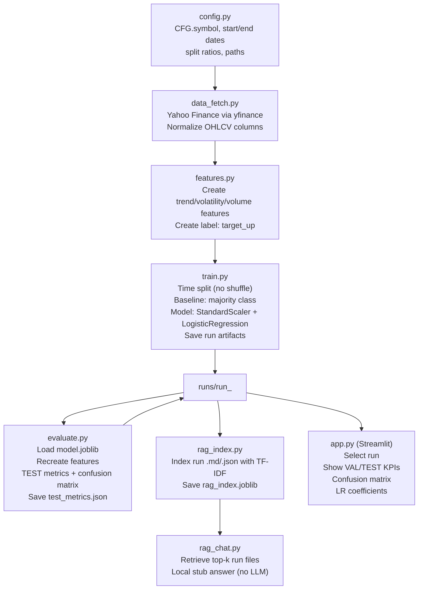

# Next-Day Direction Classifier with RAG — Stage 1 (Trend-Based Baseline)

Stage 1 is a **learning-focused** machine learning project that predicts the **next trading day direction** for a single stock/ETF (default: `SPY` or any stocks tickers") using **Yahoo Finance daily OHLCV data** and simple **trend/volatility/volume features**.

It includes:
- A reproducible **train → evaluate** pipeline (time-based splits, no shuffling)
- Saved run artifacts (model + metrics) under `./runs/`
- A lightweight **RAG (local stub)** that retrieves relevant run files for questions
- A **Streamlit dashboard** that visualizes metrics and basic model interpretability

> Not investment advice. This is for education and portfolio demonstration.

---

## What Stage 1 Predicts (and What It Does NOT)

**Stage 1 target (binary classification):**
- `target_up = 1` if `Close[t+1] > Close[t]`
- `target_up = 0` otherwise

**This is NOT a price forecast** and does not guarantee real-world trading performance. It is a baseline “trend-based” learning system designed to be extended in Stage 2.

---

## Repository Structure (typical)

```
finance_direction_rag/
  src/
    config.py
    data_fetch.py
    features.py
    train.py
    evaluate.py
    rag_index.py
    rag_chat.py
  runs/
    run_<SYMBOL>_<TIMESTAMP>/
      model.joblib
      metrics.json
      report.md
      test_metrics.json
    rag_index.joblib
  data/
    raw/          (optional export if you choose to save raw pulls)
    processed/    (optional export for engineered dataset)
  app.py          (Streamlit dashboard)
```

---

## Mermaid Flowchart (Stage 1 pipeline)



---

## Setup

### 1) Create and activate a virtual environment
```bash
python -m venv .venv
source .venv/bin/activate    # macOS/Linux
# .venv\Scripts\activate     # Windows PowerShell
```

### 2) Install dependencies
Minimum typical requirements:
```bash
pip install -U pip
pip install pandas numpy scikit-learn joblib yfinance streamlit matplotlib
```

---

## Configuration

Edit `src/config.py`:

- `CFG.symbol`: the Yahoo Finance ticker (default `SPY`)
- `CFG.start_date`: default `"2015-01-01"` (recommended for enough history)
- `CFG.end_date`: `None` means “latest available”

Example:
```python
symbol: str = "SPY"
start_date: Optional[str] = "2015-01-01"
end_date: Optional[str] = None
```

---

## How to Run (Stage 1)

Run all commands **from the project root** (same level as `src/` and `runs/`).

### 1) Train
```bash
python -m src.train
```

Expected output:
- A new folder under `runs/` like:
  `runs/run_SPY_YYYYMMDD_HHMMSS/`
- `model.joblib`, `metrics.json`, `report.md`

### 2) Evaluate (creates TEST metrics)
Copy the run directory printed by training and pass it into evaluate:
```bash
python -m src.evaluate runs/run_SPY_YYYYMMDD_HHMMSS
```

Expected output:
- `test_metrics.json` saved into the same run folder

### 3) Build the RAG index (over run artifacts)
```bash
python -m src.rag_index
```

### 4) Ask questions in the RAG CLI (local stub)
```bash
python -m src.rag_chat
```

Example questions:
- “What was the baseline validation accuracy vs the model accuracy?”
- “Which run had the best validation accuracy?”
- “Show me the confusion matrix for the latest run.”
- “What features were used in training?”

### 5) Launch the Streamlit dashboard
```bash
streamlit run app.py
```

What you’ll see:
- Run selector
- Baseline vs model validation accuracy
- Test accuracy (after evaluation)
- Confusion matrix (after evaluation)
- Logistic Regression coefficients (feature importance proxy)

---

## Changing to a New Stock (Single-ticker Stage 1)

1) Update `CFG.symbol` in `src/config.py` (example: `AAPL`, `MSFT`, `NVDA`)
2) Re-run:
```bash
python -m src.train
python -m src.evaluate runs/run_<NEW>_YYYYMMDD_HHMMSS
python -m src.rag_index
streamlit run app.py
```

---
## License / Disclaimer

This project is for educational and portfolio use. It does not provide financial advice and should not be used as a sole basis for investment decisions.
