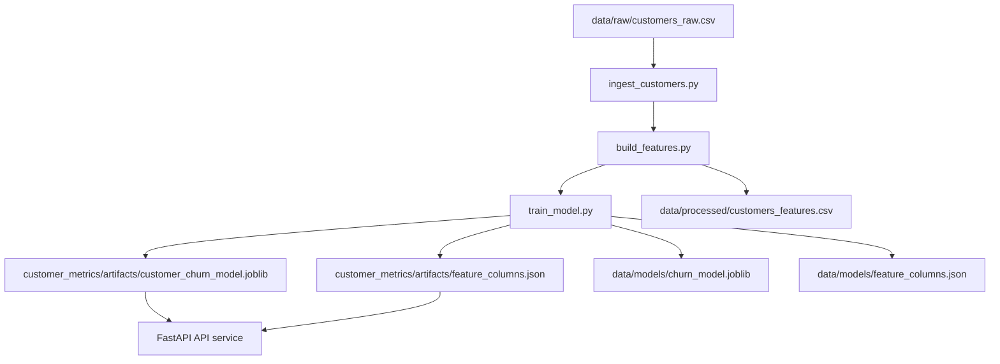

# Customer Metrics Pipeline & API
A small, reviewer-friendly project that:
1) **builds a churn-style model** from a customer CSV via a simple ETL/feature pipeline, and  
2) **serves predictions** through a **FastAPI** endpoint with saved artifacts.

This repo is intentionally lightweight: clear run steps, visible outputs, and a simple API surface.

---

## What this project demonstrates
- **ETL → features → model training → saved artifacts** (model + feature schema)
- **FastAPI inference service** loading the saved artifacts
- A reproducible, “easy to evaluate” workflow (single command to rebuild artifacts)

---

## Repository layout (as in this folder)
```text
Customer Metrics Pipeline & API/
├─ customer_metrics/
│  ├─ api/
│  │  ├─ __init__.py
│  │  └─ main.py
│  ├─ pipeline/
│  │  ├─ __init__.py
│  │  ├─ ingest_customers.py
│  │  ├─ build_features.py
│  │  └─ train_model.py
│  ├─ artifacts/
│  │  ├─ customer_churn_model.joblib
│  │  └─ feature_columns.json
│  ├─ __init__.py
│  └─ config.py
├─ data/
│  ├─ raw/
│  │  └─ customers_raw.csv
│  ├─ processed/
│  │  └─ customers_features.csv
│  └─ models/
│     ├─ churn_model.joblib
│     └─ feature_columns.json
├─ README.md
├─ requirements.txt
└─ run_pipeline.py
```

> Note on artifacts: this project may write **two copies** of artifacts:
> - `customer_metrics/artifacts/` (used by the API at runtime)
> - `data/models/` (a convenient, “easy to find” export for reviewers)
>
> If you prefer only one location, keep `customer_metrics/artifacts/` as the source of truth and remove/ignore `data/models/`.

---

## Pipeline flow (Mermaid)


---

## Re-run everything (clean rebuild)
These steps rebuild outputs from scratch and are the simplest “reviewer path.”

### 1) Create a virtual environment
```bash
python -m venv .venv
# Windows:
# .venv\Scripts\activate
# macOS/Linux:
# source .venv/bin/activate
```

### 2) Install dependencies
```bash
pip install -r requirements.txt
```

### 3) Rebuild artifacts (ETL → features → model)
```bash
python run_pipeline.py
```

After the run, you should see:
- `customer_metrics/artifacts/customer_churn_model.joblib`
- `customer_metrics/artifacts/feature_columns.json`
- `data/processed/customers_features.csv`
- (optional export) `data/models/*`

---

## Run the API locally
### Start the server
From the project root:
```bash
python -m uvicorn customer_metrics.api.main:app --reload
```

### Quick checks
Health check:
```bash
curl http://127.0.0.1:8000/health
```

OpenAPI docs:
- `http://127.0.0.1:8000/docs`

---

## How to call `/predict`
The API expects a JSON payload matching the feature schema used by the model.

Recommended way to confirm the expected inputs:
- Open `customer_metrics/artifacts/feature_columns.json`
- Inspect the raw columns in `data/raw/customers_raw.csv`

Example request (shape only — update keys to match your `feature_columns.json`):
```bash
curl -X POST "http://127.0.0.1:8000/predict"   -H "Content-Type: application/json"   -d '{
    "feature_1": 123,
    "feature_2": "A",
    "feature_3": 45.6
  }'
```

---

## What to review (fast evaluator guide)
If you only have 2–3 minutes:
1. `run_pipeline.py` — single entrypoint for rebuild
2. `customer_metrics/pipeline/*` — ingestion → features → training
3. `customer_metrics/api/main.py` — model loading + `/health` + `/predict`
4. `customer_metrics/artifacts/` — saved model + schema

---

## Notes / assumptions (honest scope)
- This is a **portfolio-style** pipeline and inference service: the goal is clarity and reproducibility over production scale.
- If you want to harden this further: add unit tests, schema validation on inputs, and a minimal CI workflow (lint + tests).
