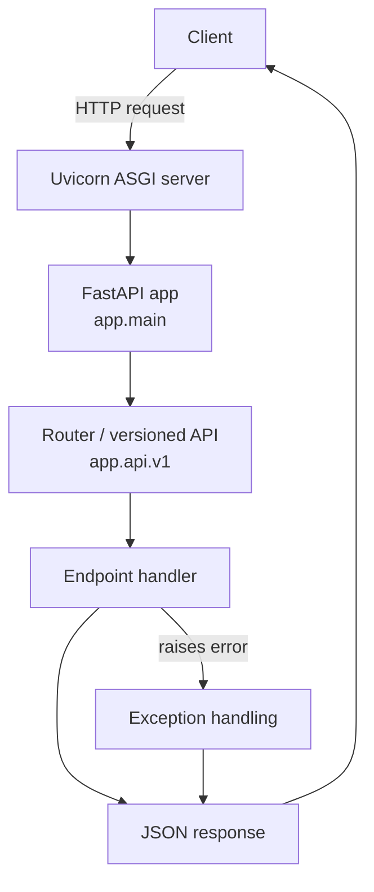

# Hello-Prod FastAPI

A tiny **production-style FastAPI starter** you can run locally in minutes:

- Clear app structure (`app/`, `tests/`, config module)
- Versioned API router (`app/api/v1.py`)
- Health check + tests (`tests/test_health.py`)
- Scripted dev run (`run_dev.sh`)
- Interactive docs (Swagger / ReDoc)

---

## Project structure

```
Hello-Prod-FastAPI/
├─ app/
│  ├─ __init__.py
│  ├─ config.py
│  ├─ main.py
│  └─ api/
│     ├─ __init__.py
│     └─ v1.py
├─ tests/
│  └─ test_health.py
├─ requirements.txt
├─ run_dev.sh
└─ README.md
```

---

## Prerequisites

- Python **3.11+** (3.10 is usually fine)
- `pip` + `venv`
- macOS/Linux shell or Windows PowerShell

---

## How to re-run everything (clean end-to-end)

### 1) Create / refresh your virtual environment

**macOS / Linux**
```bash
cd Hello-Prod-FastAPI
rm -rf .venv
python -m venv .venv
source .venv/bin/activate
python -m pip install --upgrade pip
pip install -r requirements.txt
```

**Windows (PowerShell)**
```powershell
cd Hello-Prod-FastAPI
rmdir /s /q .venv
python -m venv .venv
.\.venv\Scripts\Activate.ps1
python -m pip install --upgrade pip
pip install -r requirements.txt
```

### 2) Run the API (dev)

Option A — use the script:
```bash
./run_dev.sh
```

Option B — run Uvicorn directly:
```bash
uvicorn app.main:app --reload --host 0.0.0.0 --port 8000
```

### 3) Smoke test locally

Open:
- Swagger UI: `http://127.0.0.1:8000/docs`
- ReDoc: `http://127.0.0.1:8000/redoc`

Or via curl:
```bash
curl -s http://127.0.0.1:8000/health | python -m json.tool
```

### 4) Run tests

```bash
pytest -q
```

If tests fail after dependency changes, repeat step (1) to rebuild the environment.

---

## Endpoints (typical)

These are the common “reviewer” endpoints in this repo:

- `GET /health` — health check used by tests and smoke checks
- `GET /docs` — Swagger UI (OpenAPI)

(Additional routes live under `app/api/v1.py`.)

---

## Request flow (Mermaid)

High-level request path through the app (startup → routing → handler → response):



> If Mermaid doesn’t render on your viewer, ensure the renderer supports Mermaid *and* that the fenced block is exactly ```mermaid.

---

## Notes

- `app/config.py` typically centralizes settings (env vars, defaults). If you add env vars later, document them here.
- Keep `tests/` aligned with your public endpoints so reviewers can run `pytest` and trust the health checks.
