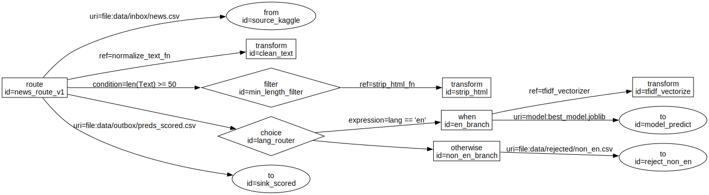

# XML Flow Visualizer

Turns EIP-style integration XML (Apache Camel-like routes: sources, filters,
routers, transforms, sinks) into a flow diagram. Ships as a cross-platform
desktop app (macOS + Windows) and a CLI.



## What it does

Given XML like `sample_eip.xml`, it walks the element tree and produces a
directed graph:

- **Sources / sinks** (`from`, `to`) → ovals
- **Routers / filters** (`choice`, `filter`, `when`) → diamonds
- **Transforms** (`transform`, `map`) → boxes
- Edges are labeled with `uri` / `ref` / `condition` / `expression` attributes

It's schema-agnostic — point it at any XML and it'll draw the tree.

## Architecture

```
converter.py      XML -> graph -> Graphviz DOT (stdlib only, no deps)
render.py         hybrid renderer (Graphviz binary OR matplotlib fallback)
gui_app.py        Tkinter desktop app (cross-platform, stdlib GUI)
main.py           command-line interface
test_converter.py pytest unit tests
packaging.spec    PyInstaller spec for building a double-click app
```

The conversion logic (`converter.py`) has **zero dependencies** — just the
standard library. Rendering and the GUI add `networkx`, `matplotlib`, and
optionally Graphviz.

## The cross-platform rendering strategy

Rendering a graph well normally needs the native **Graphviz** binary, which is
a pain to bundle (an earlier version of this project shipped a broken 0-byte
`dot.exe`). Instead, `render.py` uses a **hybrid** approach:

1. **If the Graphviz `dot` binary is installed**, shell out to it for a polished
   hierarchical layout — the gold standard for flow diagrams.
2. **Otherwise**, fall back to `networkx` + `matplotlib` (pure-Python pip
   wheels, no native dependency) with a custom left-to-right layered layout.

The app **always works** on a fresh machine, and gets sharper if Graphviz is
present. The status bar tells you which backend is active.

## Setup

```bash
cd "XML Visualization"
python3 -m venv .venv
source .venv/bin/activate          # Windows: .venv\Scripts\activate
pip install -r requirements.txt
```

### Optional: install Graphviz for the best output

- **macOS**: `brew install graphviz`
- **Windows**: `choco install graphviz` (or download from graphviz.org)

Without it, the matplotlib fallback is used automatically.

## Run the desktop app

```bash
python gui_app.py
```

Open an XML file (or click **Sample**), and the diagram renders in-window. You
can switch layout direction (LR/TB), view the generated DOT source in a tab,
and export to PNG / SVG / DOT.

## Run the CLI

```bash
# Write a DOT file
python main.py sample_eip.xml

# Write DOT and render an image (uses the hybrid backend)
python main.py sample_eip.xml --render png

# Top-to-bottom layout, custom output
python main.py route.xml -o out.dot --rankdir TB --render svg
```

## Run the tests

```bash
python -m pytest test_converter.py -q
```

9 tests covering namespace stripping, shape heuristics, graph counts, edge
labels, DOT validity, quote escaping, and malformed-input handling.

## Build a double-click app

To ship a standalone app that runs **without Python installed**:

```bash
pip install pyinstaller
pyinstaller packaging.spec
```

Output in `dist/`:
- **macOS** → `dist/XMLFlowVisualizer.app` (drag to Applications)
- **Windows** → `dist/XMLFlowVisualizer/XMLFlowVisualizer.exe`

Build on each OS you want to ship for — PyInstaller can't cross-compile (no
building a Mac app from Windows). The matplotlib fallback is bundled, so the
packaged app works even on machines without Graphviz.

## What changed from the original

- `gui_app.py` was an empty stub → now a full Tkinter app.
- `main.py` hardcoded the input filename → now a proper CLI with `argparse`.
- Conversion logic extracted into `converter.py` so the CLI, GUI, and tests
  share one implementation.
- Added error handling for malformed XML and missing files.
- Removed the broken `graphviz/bin/dot.exe` placeholder; replaced the whole
  rendering approach with the hybrid backend.
- Added unit tests and PyInstaller packaging.
