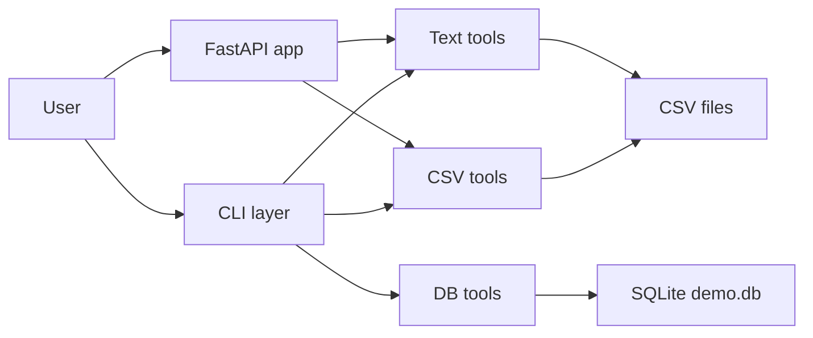

# python-foundations-toolkit

A small, deliberately simple Python project that demonstrates **foundational engineering practices**:

- Clean package layout (`toolkit/`, `core/`, `tests/`)
- A **CLI** with subcommands for CSV, text, and SQLite
- A tiny **FastAPI** service that reuses the same core logic
- File I/O (CSV, text), basic **SQLite** access, and simple logging
- A couple of **pytest** tests wired to the package

It is not meant to be “feature-complete”, but to show how you structure and ship small, reliable tools.

---

## High-level architecture


## Project layout

```text
python-foundations-toolkit/
  data/
    demo.db        # small SQLite DB with items table (for db-query)
    sample.csv     # demo CSV file
    sample.txt     # demo text file
  toolkit/
    __init__.py
    cli.py         # CLI entry point: csv-summary, text-summary, db-query
    api.py         # FastAPI app: /health, /csv-summary, /text-summary
    core/
      __init__.py
      csv_tools.py # summarize_csv()
      text_tools.py
      db_tools.py  # run_query()
  tests/
    conftest.py    # adds project root to sys.path for tests
    test_csv_tools.py
    test_text_tools.py
  README.md
  requirements.txt
```

Python 3.10+ is recommended (tested on 3.13).

---

## Installation

From the project root:

```bash
python -m venv .venv
source .venv/bin/activate        # Windows: .venv\Scripts\activate

pip install -r requirements.txt
```

`requirements.txt` should include at least:

```txt
fastapi>=0.115.0
uvicorn>=0.30.0
pytest>=8.0.0
pytest-cov>=5.0.0  # optional: coverage reports
```

---

## Demo data

The project expects a couple of small example files under `data/`. You can customize them, but this is a good starting point.

### `data/sample.csv`

```csv
name,age,city
Alice,30,New York
Bob,25,San Francisco
Charlie,35,Chicago
Dana,28,Boston
```

### `data/sample.txt`

```text
Hello world
Hello Python foundations toolkit
This is a small sample file for testing.
Python makes it easy to work with text and data.
```

### `data/demo.db` (SQLite)

Create or reset the demo SQLite database with a single command from the project root:

```bash
rm -f data/demo.db

sqlite3 data/demo.db << 'EOF'
DROP TABLE IF EXISTS items;

CREATE TABLE items (
    id INTEGER PRIMARY KEY AUTOINCREMENT,
    name TEXT NOT NULL,
    category TEXT NOT NULL,
    price REAL NOT NULL,
    in_stock INTEGER NOT NULL
);

INSERT INTO items (name, category, price, in_stock) VALUES
  ('Widget',     'Gadgets',  9.99,  1),
  ('Gadget',     'Gadgets', 14.50,  1),
  ('Doohickey',  'Tools',    4.75,  0),
  ('Thingamajig','Tools',   19.99,  1);
EOF
```

You can verify:

```bash
sqlite3 data/demo.db "SELECT * FROM items;"
```

---

## CLI usage

The CLI is invoked via the `toolkit.cli` module:

```bash
python -m toolkit.cli --help
```

Global options:

- `-v` / `--verbose` – enable more detailed logging.

### `csv-summary`

Summarize a CSV file (columns, row count, preview rows):

```bash
python -m toolkit.cli csv-summary data/sample.csv
```

With options:

```bash
python -m toolkit.cli csv-summary data/sample.csv \
  --delimiter "," \
  --preview 5
```

Example output (abbreviated):

```text
CSV summary for data/sample.csv
  Columns (3): name, age, city
  Rows (excluding header): 4

Preview (first 4 rows):
  Alice | 30 | New York
  Bob | 25 | San Francisco
  ...
```

### `text-summary`

Summarize a text file (line/char/word counts, top words):

```bash
python -m toolkit.cli text-summary data/sample.txt --top 5
```

Example output (abbreviated):

```text
Text summary for data/sample.txt
  Lines: 4
  Characters: 154
  Words: 24

Top 5 words:
  python: 2
  hello: 2
  ...
```

### `db-query`

Execute a read-only query against the SQLite database:

```bash
python -m toolkit.cli db-query data/demo.db "SELECT * FROM items;"
```

Limit results:

```bash
python -m toolkit.cli db-query data/demo.db \
  "SELECT name, price FROM items WHERE in_stock = 1;" \
  --max-rows 10
```

---

## FastAPI service

The same CSV/text logic is exposed via a small FastAPI app.

### Run the server

From the project root:

```bash
uvicorn toolkit.api:app --reload
```

Server defaults to `http://127.0.0.1:8000`.

### Endpoints

- `GET /health`  
  Simple health check.

- `POST /csv-summary`  
  Body:

  ```json
  {
    "path": "data/sample.csv",
    "delimiter": ",",
    "max_preview_rows": 5
  }
  ```

- `POST /text-summary`  
  Body:

  ```json
  {
    "path": "data/sample.txt",
    "top_n": 5
  }
  ```

Interactive docs (Swagger UI):

- `http://127.0.0.1:8000/docs`

---

## Running tests

Tests live under `tests/` and exercise the core modules. `tests/conftest.py` ensures the project root is on `sys.path` so `import toolkit` works.

Run:

```bash
pytest
```

You should see both tests pass.

---

```bash
uvicorn toolkit.api:app --reload
# open: http://127.0.0.1:8000/docs
```

---

## Coverage (optional)

Coverage flags come from **pytest-cov**.

Install (if not already in your environment):

```bash
python -m pip install pytest-cov
```

Run coverage in the terminal:

```bash
python -m pytest --cov=toolkit --cov-report=term-missing
```

Optional HTML report:

```bash
python -m pytest --cov=toolkit --cov-report=html
open htmlcov/index.html
```

---

## Common issues / troubleshooting

### `zsh: command not found: pytest`
`pytest` is not installed in the active environment, or your shell is not using the expected venv.

Fix:

```bash
source .venv/bin/activate
python -m pip install pytest
python -m pytest -q
```

### `pytest: error: unrecognized arguments: --cov=toolkit`
You’re missing **pytest-cov**.

Fix:

```bash
python -m pip install pytest-cov
python -m pytest --cov=toolkit --cov-report=term-missing
```

### `which python` doesn’t point to `.venv`
Your session is not using the venv interpreter.

```bash
which python
source .venv/bin/activate
hash -r
which python
```

### `ModuleNotFoundError: toolkit`
Make sure you’re running from the repo root and that tests are using the project root on `sys.path`.

```bash
pwd
python -c "import toolkit; print(toolkit.__file__)"
```

## Why this project exists

This repo is intentionally small, but it shows:

- How to structure a Python package (`toolkit/` + `core/`)
- How to expose the same logic via **CLI** and **HTTP API**
- How to work with **files** and **SQLite** in a straightforward, testable way
- How to add a couple of **pytest** tests to keep core logic from regressing

It is a portfolio-style “foundations” project: the code is simple on purpose, so the focus is on structure, tooling, and reliability, rather than on complex algorithms.
